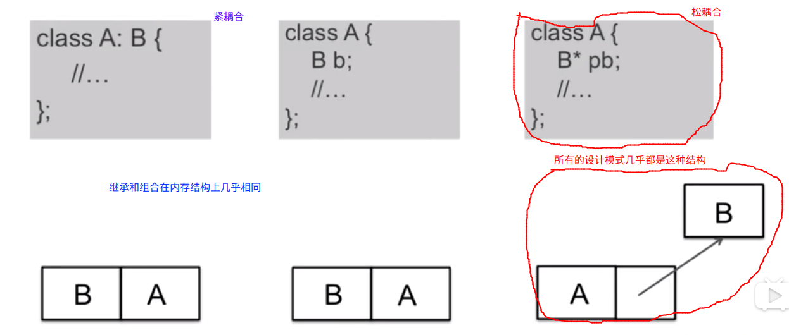

# 设计模式总结

## 一个目标

* **管理变化，提高复用**

## 两种手段

* 分解 vs 抽象

## 八大原则

* 依赖倒置原则

高层的模块不应该依赖底层的模块，应该依赖于抽象；抽象不应该依赖细节，细节应该依赖抽象

* 开放封闭原则

软件的实体（类，模块，函数等）应该对扩展开放，对修改封闭。

上面的两个目标看似是相互矛盾的，因为通常情况下扩展模块的常规的方法就是修改这个模块，一个不能被修改的模块往往意味着固定的行为。

问题的关键在于抽象: 一个类在使用另一个具体类的时候，应该依赖于它的抽象接口。这样即使需求发生了变化，我们只需要衍生新的抽象类的新的实例，就可以实现功能上面的修改

* 单一职责原则

不要存在多个导致类变更的原因。通俗的来说，就是一个类负责一个职责

* Liskov 替换原则

里氏替换原则，在一个类 $B$ 继承类 $A$ 的时候，除了新添加的方法以外，尽可能的不要去重写父类 $A$ 的方法，也尽可能的不要去重载父类 $A$ 的方法

继承作为面向对象的三大特性（封装，继承，多态）之一，带来巨大的帮助的同时，也增加了对象之间的耦合，降低了程序的可移植性。

* 接口隔离原则

不应该强行要求客户端依赖于它们不用的接口；其二是类之间的依赖应该建立在最小的接口上面

* 对象组合优于类继承

在类中直接声明具体的类对象和继承从内存结构上来说没有太大的差别，耦合度都非常的高。在类中使用抽象指针（组合）可以将依赖性降低到最小

* 封装变化点
* 面向接口编程

## 重构技法

* 静态 $\rightarrow$ 动态
* 早绑定 $\rightarrow$ 晚绑定（将绑定的过程放在更加高层的模块当中，保持底层模块的稳定（依赖于抽象））
* 继承 $\rightarrow$ 组合（抽象类的指针，接口的指针）
* 编译时依赖 $\rightarrow$ 运行时依赖（多态）
* 紧耦合 $\rightarrow$ 松耦合

## 从封装变化的角度对模式进行分类

1. 组件协作
   * Template Method
   * Strategy 
   * Oberver / Event
2. 单一职责
   * Decorator
   * Bridge
3. 对象创建
   * Factory Method
   * Abstract Factory
   * Prototype
   * Builder
4. 对象性能
   * Singleton
   * FlyWeight
5. 接口隔离
   * Facade
   * Proxy
   * Mediator
   * Adapter
6. 状态变化
   * Memento : 现在很多优秀的序列化的方法代替了这种面向对象的快照保存方法
   * State
7. 数据结构
   * Composite
   * Iterator : 面向对象的Iterator 现在已经被抛弃了
   * Chain of Resposibility
8. 行为变换
   * Command : C++ 当中现在可能更多的使用 函数对象来实现相似的功能
   * Vsistor ： 使用的条件很苛刻，通常不用，一旦使用往往范围很大
9. 领域问题
   * Interpreter : 比较简单的文法的问题可以使用这个解决，比较复杂的文法问题往往复杂度很高，性能成为问题

随着发展，很多设计模式现在用的比较的少

## C++ 对象模式

## 什么时候不使用设计模式

* 代码可读性很差时
* 需求理解还很浅时
* 变化没有显现时
* 不是系统的关键依赖点
* 项目没有复用价值
* 项目将要发布时

## 经验

* 不要为模式而模式
* 关注抽象类 & 接口
* 理清变化点和稳定点
* 审视依赖关系
* 要有 Framework 和 Application 隔离的思维
* 良好的设计时演化的结果