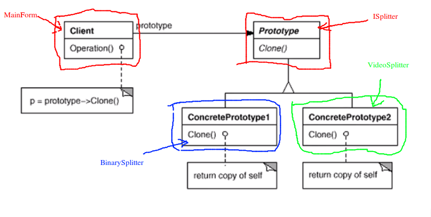

# Prototype 原型模式

## 动机

* 在软件系统当中，经常面对某一些结构复杂的对象的创建的过程；由于需求的变化，这些对象经常面对着剧烈的变化，但是它们却拥有着比较稳定一致的接口

## 模式定义

* 使用原型实例指定创建对象的种类，然后通过拷贝这些原型来创建新的对象

## 例子

我们考虑前面工厂模式下的例子：

```FactorySplitter``` :

```c++
//抽象
class ISplitter{
public:
	virtual void split() = 0;
	virtual ~ISplitter() {}
};

//抽象
class SplitterFactory{
public:
	virtual ISplitter* CreateSplitter() = 0;
	virtual ~SplitterFactory() {}
};

// 具体类
class BinarySplitter : public ISplitter{
public:
	virtual void split(){
		//.....
	}
};

class TxtSplitter : public ISplitter{
public:
	virtual void split(){
		// ******
	}
};

class PictureSplitter : public ISplitter{
public:
	virtual void split(){
		// ....
	}
};

class VideoSplitter : public ISplitter{
public:
	virtual void split(){
		// .......
	}
};

/**
 * 每一个具体的类，都有一个自己具体的工厂类
*/
// 具体工厂
class BinarySplitterFactory : public SplitterFactory{
public:
	virtual ISplitter* CreateSplitter(){
		return new BinarySplitter();
	}
};

class TxtSplitterFactory : public SplitterFactory{
public:
	virtual ISplitter* CreateSplitter(){
		return new TxtSplitter();
	}
};
 
class PictureSplitterFactory : public SplitterFactory{
public:
	virtual ISplitter* CreateSplitter(){
		return new PictureSplitter();
	}
};

class VideoSplitterFactory : public SplitterFactory{
public:
	virtual ISplitter* CreateSplitter(){
		return new VideoSplitter();
	}
};
```

```MainForm``` :

```c++
class Form{/*已经实现*/};
class TextBox{/*已经实现*/};
class ProgressBar{/*已经实现*/};

#include "./FactorySplitter.cpp"

class MainForm : public Form{
	TextBox*		textFilePath;
	TextBox*		textFileNumber;
	ProgressBar*	progressBar;

	SplitterFactory* factory;	// 工厂
public:
	MainForm(SplitterFactory* factory){
		this->factory = factory;
	}
	void Button1_Click(){
		//string filePath = textFilePath->getText();
		//int number = atoi(textFileNumber->getText().c_str());
		
		ISplitter* splitter = factory->CreateSplitter();	// 面向接口 多态的 new
		splitter->split();
	}
};
```

在工厂模式当中，我们为分割类和工厂类都设计了相应的抽象接口，MainForm 只依赖与抽象的接口，通过多态来绑定具体的工厂类型，通过工厂来获取相应的分割类。依赖被放置到更上层的代码当中。

下面我们来考虑使用 Prototype 如何解决这个问题：

```FactorySplitter``` :

```c++
//抽象
class ISplitter{
public:
	virtual void split() = 0;
	virtual ISplitter* clone() = 0; // 通过克隆自己来创建对象
	virtual ~ISplitter() {}
};

// 具体类
class BinarySplitter : public ISplitter{
public:
	virtual void split(){
		//.....
	}
	virtual ISplitter* clone(){
		return new BinarySplitter(*this);	// 调用自身的拷贝构造函数
	}
};

class TxtSplitter : public ISplitter{
public:
	virtual void split(){
		// ******
	}
	virtual ISplitter* clone(){
		return new TxtSplitter(*this);	// 调用自身的拷贝构造函数
	}
};

class PictureSplitter : public ISplitter{
public:
	virtual void split(){
		// ....
	}
	virtual ISplitter* clone(){
		return new PictureSplitter(*this);	// 调用自身的拷贝构造函数
	}
};

class VideoSplitter : public ISplitter{
public:
	virtual void split(){
		// .......
	}
	virtual ISplitter* clone(){
		return new VideoSplitter(*this);	// 调用自身的拷贝构造函数
	}
};
```

```MainForm``` :

```c++
class Form{/*已经实现*/};
class TextBox{/*已经实现*/};
class ProgressBar{/*已经实现*/};

#include "./FactorySplitter.cpp"

class MainForm : public Form{
	TextBox*		textFilePath;
	TextBox*		textFileNumber;
	ProgressBar*	progressBar;

	ISplitter* prototype;	// 原型对象
public:
	MainForm(ISplitter* prototype){
		this->prototype = prototype;
	}
	void Button1_Click(){
		//string filePath = textFilePath->getText();
		//int number = atoi(textFileNumber->getText().c_str());
		
		ISplitter* splitter = prototype->clone();	//  克隆原型
		splitter->split();
	}
};
```

## 结构



## 要点总结

1. Prototype 同样用于隔离类对象的使用者和具体类型（易变类）之间的耦合关系。它同样要求这些易变类具有**稳定的接口**
   * MainForm 就是使用者，它要使用具体的 Splitter 对象，为了防止耦合，使用 ISplitter 抽象接口。这个接口是稳定的，因为对于任意的 Splitter，都只需要实现 split() 方法就可以了
2. Prototype 模式对于“如果创建易变类的实体对象”采用“原型克隆”的方法来做，它使得我们可以非常灵活的动态创建“拥有稳定接口”的新对象---所需要的工作就是注册一个新类的对象，在需要它的地方进行克隆