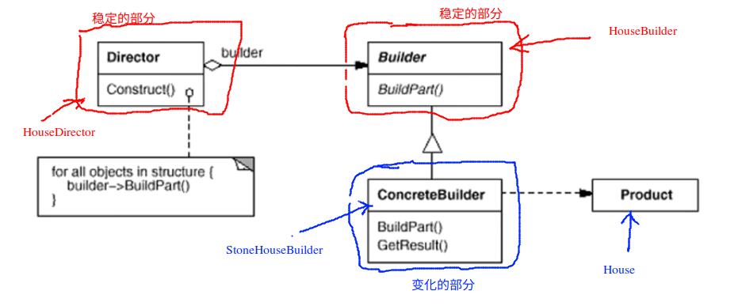

# Builder 构建器

## 动机

* 在软件系统当中，有时会面临着“一个复杂对象”的创建工作，其通常由各个部分的子对象用一定的算法构建；由于需求的变化，这个复杂对象的各个部分经常面临着剧烈的变化，但是将它们组合在以其的算法却是相对稳定

## 模式定义

* 将一个复杂对象的构建和表示相分离，使得同样的构建过程（稳定）可以创建不同的表示（变化）

## 例子

考虑建房子的过程，建房子的流程可能是固定的，但是对于不同的房子，每一个流程具体的实现可能是不同的。

```c++
class House{
public:
	/**
	 * 流程是稳定的
	*/
	void Init(){
		this->BuildPart1();

		for (int i = 0; i < 4; ++i)
		{
			this->BuildPart2();
		}
		bool flag = this->BuildPart3();
		if (flag)
			this->BuildPart4();
		this->BuildPart5();
	}
protected:
	/**
	 * 每个步骤内部又是变化的
	*/
	virtual void BuildPart1() = 0;
	virtual void BuildPart2() = 0;
	virtual bool BuildPart3() = 0;
	virtual void BuildPart4() = 0;
	virtual void BuildPart5() = 0;
};


class StoneHouse : public House{
protected:
	virtual void BuildPart1(){
		// ....
	}
	virtual void BuildPart2(){
		// ....
	}
	virtual bool BuildPart3(){
		// ....
	}
	virtual void BuildPart4(){
		// ....
	}
	virtual void BuildPart5(){
		// ....
	}
};

int main(int argc, char* argv[], char* env[])
{
	House* pHouse = new StoneHouse();
	pHouse->Init();
	// ....
}
```

> 这里的实现似乎和模板方法似乎没有没有什么区别。

> 下面的代码将 House 的属性和方法拆分开，又将稳定的方法和变化的方法拆分开。

```c++
/**
 * 属性和状态，属性和状态是稳定的
*/
class House{
	// ....
	/**
	 * House 当中有大量的属性，门，窗，墙，地砖，屋顶等等
	*/
};


/**
 * 抽象，变化的部分
*/
class HouseBuilder{
public:
	House* GetResult(){
		return this->pHouse;
	}
	virtual ~HouseBuilder() {}

	friend class HouseDirector;		// ...

protected:
	House* pHouse;
	virtual void BuildPart1() = 0;
	virtual void BuildPart2() = 0;
	virtual bool BuildPart3() = 0;
	virtual void BuildPart4() = 0;
	virtual void BuildPart5() = 0;
};

/**
 * 具体类，不同类型的房子的构建过程是变化的
*/
class StoneHouseBuilder : public HouseBuilder{
protected:
	virtual void BuildPart1(){
		//pHouse->......... = ........
		// ....
	}
	virtual void BuildPart2(){
		// ....
	}
	virtual bool BuildPart3(){
		// ....
	}
	virtual void BuildPart4(){
		// ....
	}
	virtual void BuildPart5(){
		// ....
	}
};

/**
 * 具体类
*/
class DiamondHouserBuilder : public HouseBuilder{
	// 也要实现上面的 5 个方法 BuildPart*()
};

/**
 * 这一部分是稳定的，这一部分不随着需求的变化而发生变化
 * 依赖抽象
*/
class HouseDirector{
public:
	HouseBuilder* pHouseBuilder;

	HouseDirector(HouseBuilder* houseBuilder)
	{
		this->pHouseBuilder = houseBuilder;
	}
	 /**
	  * 稳定的方法
	 */
	House* Construct(){
		pHouseBuilder->BuildPart1();

		for (int i = 0; i < 4; ++i)
		{
			pHouseBuilder->BuildPart2();
		}
		bool flag = pHouseBuilder->BuildPart3();
		if (flag)
			pHouseBuilder->BuildPart4();
		pHouseBuilder->BuildPart5();

		return pHouseBuilder->GetResult();
	}
};

int main(int argc, char* argv[], char* env[])
{
	StoneHouseBuilder*	stoneHouseBuilder = new StoneHouseBuilder();	// 变化的部分 main 中，依赖处在最上层
	HouseDirector		houseDirector(stoneHouseBuilder);
	House* 				house = houseDirector.Construct();
}
```

## 结构



## 要点总结

1. Builder 模式主要应用于“分步骤构建一个复杂的对象”。在这其中“分步骤”是一个稳定的算法，而复杂对象的各个部分则经常变化
2. 变化点在哪，封装在哪-----Builder模式主要在应对“复杂对象各个部分”的频繁需求变动。其缺点在于难以应对“分步骤构建算法”的需求变动

