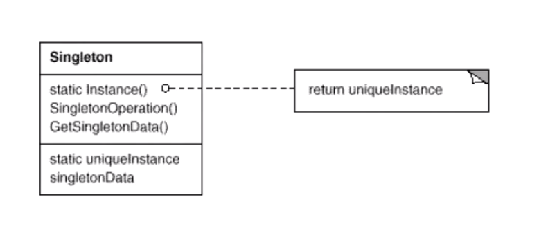

# Singleton 单件模式

## "对象性能"模式

* 面向对象很好的解决了“抽象”的问题，但是必不可免地要付出一定的代价。对于通常的情况来讲，面向对象的成本大都可以忽略不计。但是某些情况，面向对象所带来的成本必须谨慎处理
* 典型模式：
  * Singleton
  * Flyweight

## Singleton 模式

## 动机

* 在软件系统当中，经常有这样一些特殊的类，必须保证它们在徐同中只存在一个实例，才能确保它们的逻辑正确性，以及良好的效率。
* 如何绕过常规的构造器，提供一种机制来保证一个类只有一个实例？
* 这应该是类设计者的责任，而不是使用者的责任

## 模式定义

* 保证一个类只有一个实例，并为这个实例提供一个全局的访问点

## 实现

这个模式的方法十分的简单，那就是将类的构造函数和拷贝构造函数设置为对外不可见（private），设置自身的 static 类型的成员变量，在适当的时刻进行构造，并使用

```c++
class Singleton{
private:
	/**
	 * 将构造函数和拷贝构造函数设置为私有，防止外部公开声明这个对象
	*/
	Singleton();
	Singleton(const Singleton& other);
public:
	static Singleton*   getInstance();
	static Singleton*   m_instance;
};

Singleton* Singleton::m_instance = nullptr;

//线程非安全版本
/**
 * 如果有多个线程同时访问这个函数，可能会导致
 * 生成多个 Singleton 对象
*/
Singleton* Singleton::getInstance(){
	if (Singleton::m_instance == nullptr)
		m_instance = new Singleton();
	
	return Singleton::m_instance;
}

// 线程安全版本，但是锁的代价过高
Singleton* Singleton::getInstance(){
	Lock lock;	// 表示加锁的动作，实际锁不是这样实现的
	if (Singleton::m_instance == nullptr)
		m_instance = new Singleton();
	
	return Singleton::m_instance;
}

// 双检查锁，但是由于内存的 reorder 不安全，不可以使用
/**
 * Reorder:
 * 编译器在进行优化的过程中，可能会改变代码原有的执行逻辑顺序，比方说，new Singleton() 的过程从
 * 逻辑上讲应该是三个步骤：第一步，分配堆上的内存空间，第二步，调用相应的构造器进行构造，第三步，返回相应内存地址的指针
 * 但是编译器可能会对这样的过程进行优化，reorder之后的步骤可能变成下面的：
 * 第一步，分配堆上的内存；第二步，返回这段内存的地址；第三步，调用相应的构造器
 * 
 * 使用双检查锁的话，就会出现相应的问题。thread_a 构建对象，返回了内存的指针，但是还没有调用相应的构造器，
 * 此时 thread_b 读取发现对象不是 nullptr,认为对象完成了构造，返回对象地址，并进行使用，就会出错
*/
Singleton* Singleton::getInstance(){
	if (Singleton::m_instance == nullptr)
	{
		Lock lock;
		if (Singleton::m_instance == nullptr)
			Singleton::m_instance = new Singleton();
	}
	return Singleton::m_instance;
}
```

> 这样的实现问题都会出现在多线程访问的过程中
>
> 不同的编程语言有不同的方法去解决 双检查锁的问题：

```c++
// C++ 11 版本之后的跨平台的实现 （volatile）
#include <atomic>
#include <mutex>

class Singleton{
private:
	/**
	 * 将构造函数和拷贝构造函数设置为私有，防止外部公开声明这个对象
	*/
	Singleton();
	Singleton(const Singleton& other);
public:
	static std::atomic<Singleton*>		m_instance;
	static std::mutex 					m_mutex;
	static Singleton* 					getInstance();
};

// C++ 11 所实现的双检查锁
Singleton*  Singleton::getInstance(){
	Singleton* temp = m_instance.load(std::memory_order_relaxed);
	std::atomic_thread_fence(std::memory_order_acquire);    // 获取内存 fence
	if (temp == nullptr)
	{
		std::lock_guard<std::mutex> lock(m_mutex);
		temp = m_instance.load(std::memory_order_relaxed);
		if (temp == nullptr)
		{
			temp = new Singleton();
			std::atomic_thread_fence(std::memory_order_release);
			m_instance.store(temp, std::memory_order_relaxed);  // 释放内存 fence
		}
	}
	return temp;
}
```

## 结构



## 要点总结

1. Singleton 模式中的实例构造器可以设置为 protected 以允许子类进行派生
2. Singleton 模式一般不需要支持拷贝构造函数和 Clone() 接口，因为这将会导致多个对象的实例，与 Singleton模式的初衷违背
3. 如何实现在多线程环境下的安全的 Singleton ? 注意堆双检查锁的正确的实现