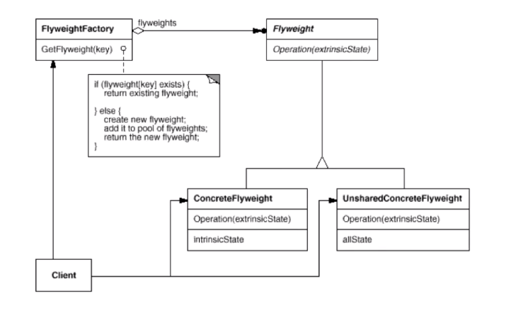

# Flyweight 享元模式

## 动机

* 在软件系统参用纯粹对象方案的问题在于大量细粒度的对象会很快的充斥在系统中，从而带来很高的运行时代价-----主要指内存需求方面的代价
* 如何避免大量细粒度对象问题的同时，让外部客户程序仍然能够透明的使用面向对象的方式进行操作？

## 模式定义

* 运用**共享**技术有效地支持大量细粒度的对象

## 例子

```c++
#include <string>
#include <map>
using namespace std;

/**
 * 共享的内容往往是只读的，并且内容比较大的对象
 * Font 对象就是一个例子，一种字体具有非常大的字库，存储每一个符号的形状信息，我们不可能为每一个字使用
 * 一个 Font 对象。所以需要进行共享，一般情况下，字体的数据是不能进行修改的，是只读的数据
*/
class Font{
private:
	// unique object key
	string key;

	//object state
	// ....
public:
	Font(const string& key){
		// .....
	}
};


class FontFactory{
private:
	map<string, Font*> fontpool;
public:
	Font* getFont(const string& key){
		map<string, Font*>::iterator item = fontpool.find(key);
		if (item != fontpool.end())
			return fontpool[key];
		else
		{
			Font* font = new Font(key);
			fontpool[key] = font;
			return font;
		}
	}

	void clear(){
		// ....
	}
};
```

## 结构



## 要点总结

1. 面向对象的程序很好的解决了抽象性的问题，但是作为一个运行在机器中的程序实体，我们需要考虑对象的代价问题。flywieght 主要解决的是面向对象的代价问题，一般不触及面向对象的抽象问题
2. Flyweight采用对象共享的做法来降低系统中对象的个数，从而降低细粒度对象给系统带来的内存压力。在具体实现方面，要注意对象状态的处理
3. 对象的数量太大从而导致对象内存开销加大---什么样的数量才算大？这需要我们仔细根据具体应用情况进行评估，而不是凭空判断