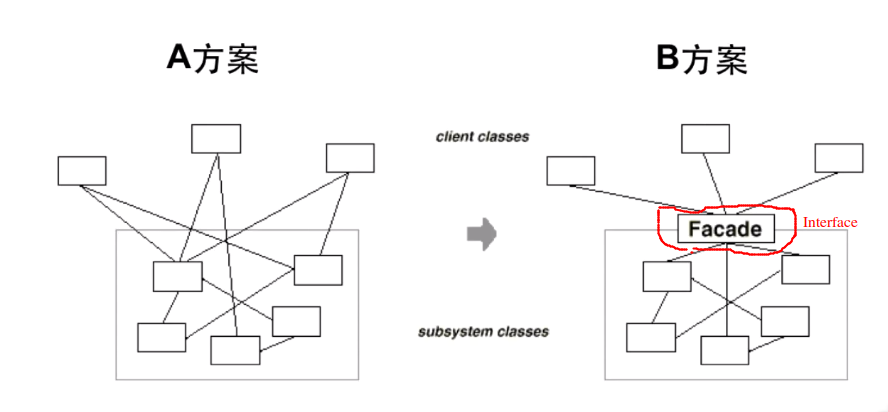
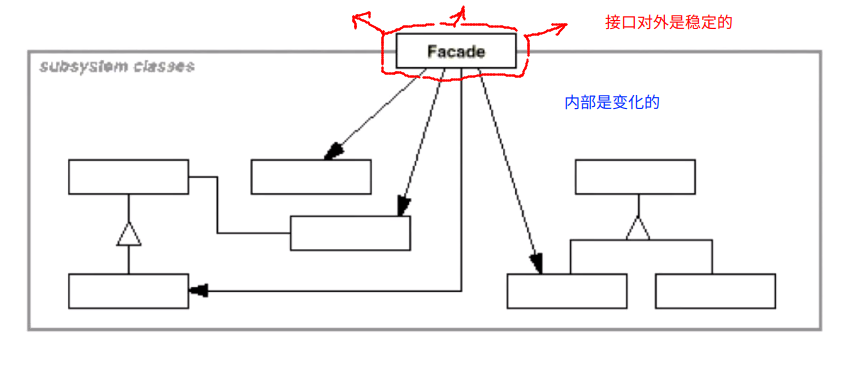

# Facade 门面模式

## “接口隔离”模式

* 在组件构建的过程中，某些接口之间直接的依赖常常会带来很多的问题，甚至根本无法实现。**采用添加一层间接（稳定）接口**，来**隔离**本来相互紧密关联的接口是一种常见的解决方案
* 典型模式
  * Facade
  * Proxy
  * Adapter
  * Mediator

## 间接的思路

> 间接的思想是一种非常常用的思想，在操作系统诞生之前，程序需要直接和硬件打交道，这个过程非常的复杂。之后引入了操作系统的概念，操作系统作为硬件和软件的中间层是稳定的部分，而应用软件是变化的部分，因此操作系统成为硬件和应用软件之间的一层接口，这就是一种间接的思想。在操作系统之上我们发现还有可以稳定的部分，例如虚拟机，在 java 中虚拟机就成为了代码和操作系统之间的一层接口。在设计原则中，依赖倒置原则也是一种间接的思想：A依赖于B， 使用依赖导致变为，A 依赖于 I 接口，B 同样依赖于 I 接口，等等。

## 系统间耦合的复杂度

## 动机

* 上述的 A  方案的问题在于组件的客户和组件中各种复杂的子系统有了过多的耦合，随着外部客户程序和各个子系统的演化，这种过多的耦合面临很多变化的挑战

## 模式定义

* 为子系统中的一组接口提供一个一致（稳定）的界面，Facade 模式定义一个高层的接口，这个接口使得这一子系统更加容易使用（复用）

## 结构

## 要点总结

1. 从客户程序的解读来看，Facade模式简化了整个组件系统的接口，对于组件内部与外部客户程序来说，达到一种“解耦”的效果-----内部子系统的任何变化不会影响到 facade 接口的变化
2. Facade 模式更加注重从架构的层次去看整个系统，而不是单个类的层次。Facade很多时候是一种架构设计模式
3. Facade 设计模式并不是一个集装箱，可以任意的放进去任何多的对象，Facade 设计模式中的组件的内部应该是“相互耦合关系比较大的一系列的组件”，而不是简单的功能的集合

