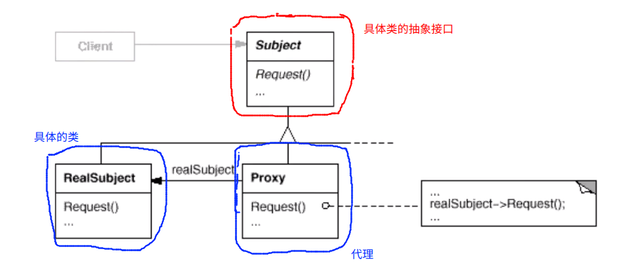

# Proxy 代理模式

## 动机

* 在面向对象的系统中，有些对象由于某些原因（比如**对象创建的开销很大**，或者某些操作需要安全控制，或者需要进程外的访问等），直接访问会给使用者，或者系统结构带来很多麻烦
* 如何在不失去**透明操作**对象的同时来管理/控制这些对象特有的复杂性？增加一层间接层是软件开发中常见的解决方法

## 模式定义

* 为其他对象提供一种代理以控制（隔离，**使用接口**）堆这个对象的访问

## 实用性

* 远程代理：为一个位于不同的地址空间的对象提供一个本地的代理对象。这个不同的地址空间可以是在同一台主机中，也可是在另一台主机中
* 虚拟代理：如果我们需要创建的对象是一个消耗内存非常大的对象，那么一般我们会使用代理先创建一个比较小的对象，满足基本的使用需求。当真正需要这个对象的时候，我们才去生成一个完整的对象
* 保护代理：控制对原始对象的访问。可以使用不同的权限通过代理对原始的对象进行访问
* 智能指引：取代了简单的指针，它在进行对象的访问的过程中提供了一些额外的操作
* Copy-on-Write 代理：它是虚拟代理的一种，它将克隆的过程延迟到客户真正需要使用对象的时候才执行。比方说字符串的拷贝。一般只进行字符串的拷贝，代理进行浅拷贝，只有当客户需要对字符串进行修改的时候，才进行深拷贝

## 例子

```c++
class ISubject
{
public:
	virtual void process();
};

class RealSubject : public ISubject
{
public:
	virtual void process()
	{
		// .......
	}
};

class ClientApp{
	ISubject* subject;
public:
	ClientApp(){
		this->subject = new RealSubject();
		/**
		 * 在某些情况下，我们可能由于各种原因，导致我们无法拿到这个 RealSubject
		 * 可能是分布式的原因，因可能是安全控的原因
		*/
	}
	void doTask(){
		// .....
		this->subject->process();
		// .....
	}
};
```

```proxy.cpp``` :

```c++
class ISubject
{
public:
	virtual void process();
};

/**
 * Proxy 的设计往往十分的复杂，大部分的情况下都是使用某些工具来自动的生成
 * 这里只是一个简单的示例
*/
class SubjectProxy : public ISubject
{
	//RealSubject		realSubject;
	/**
	 * 如果只是处于安全设计方面的考虑 或者效率方面的考虑（保护代理，智能指引等），可能这里会保留真正的对象的实例
	 * 如果是分布式的，可能这个实例都没有，只能通过一些网络访问获取某些实例相关的信息
	*/
	/**
	 * 远程代理使用网络协议，向客户端隐藏了对象不在本地计算机的事实，让客户程序感觉本地存在一个实例对象。
	*/
	/**
	 * 保护代理往往会设置对象访问的权限，让拥有不同权限的客户端访问不同的服务。
	*/
public:
	virtual void process()
	{
		// 对 realsubject 的间接访问
		// ...
		/**
		 * 这种间接的访问往往很复杂，比如说分布式的程序中，可能要完成一些网络协议和数据传输
		*/
	}
};

class ClientApp{
	ISubject* subject;
public:
	ClientApp(){
		this->subject = new SubjectProxy();
	}
	void doTask(){
		// .....
		this->subject->process();
		// .....
	}
};

/**
 * copy-on-write:
 * 	以字符串类型作为例子，某些字符串的实现往往在拷贝的过程中是进行浅拷贝，即拷贝的对象只维持原始对象的一个指针，自己并不
 * 开辟新的空间去存储字符串。这种拷贝的问题就在于当要修改字符串的时候，就面临着可能导致多个字符串对象的内容同时被修改。
 * copy-on-write:指的就是在进行字符串的修改的时候，进行一次字符串的深拷贝，丢弃以前使用的指针。在深拷贝的对象上进行修改
*/

/**
 * WEB 当中的 REST 架构
*/
```

## 结构




## 要点总结

1. “增加一层间接层”是软件系统当中对许多复杂问题的一种常见的解决方法。在面向对象的系统当中，直接使用某些对象会带来很多的问题，作为间接层的 proxy 对象便是解决这一问题的常用手段
2. 具体 proxy 设计模式的实现方法，实现粒度都相差很大，有些可能对单个对象作细粒度的控制，如 copy-on-write 技术，有些可能对组件提供抽象代理层，在架构层次对对象做 proxy
3. Proxy 并不一定要求保持接口完整一致性，只要能够实现间接控制，有时候损及一些透明性是可以接收的