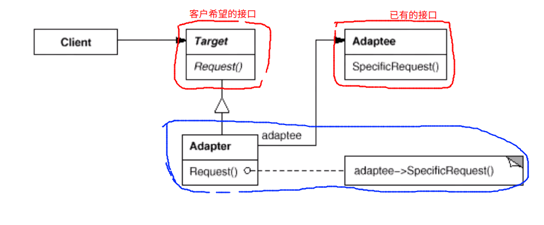

# Adapter 适配器模式

## 动机

* 在软件系统中，由于应用环境的变化，常常需要将“一些现存的对象”放在新的环境中进行使用，但是新的环境要求的接口是这些现存对象所不满足的
* 如何应对这种“迁移的变化？” 如何既能利用现有对象的良好实现，同时又能满足新的应用还建所要求的接口？

## 我们身边的 Adapter

* VGA 转 HDMI
* 电源适配器：220V 交流电转 直流电

## 模式定义

* 将一个类的接口转化为客户希望的另一个接口。Adapter模式使得原本由于接口不兼容而不能一起工作的那些类可以一起工作

## 例子

```c++
/**
 * 目标接口（新的接口）
*/
class ITarget{
public:
	virtual void process() = 0;
};

// 遗留接口（旧的接口）
class IAdaptee{
public:
	virtual void foo(int data) = 0;
	virtual int bar() = 0;
};

// 遗留的具体类
class OldClass : public IAdaptee{
public:
	virtual void foo(int data){
		// ....
	}
	virtual int bar() {
		// ....
	}
};

// 对象适配器
class IAdaptor : public ITarget{	// 继承
protected:
	IAdaptee* pAdaptee;	// 组合
	/**
	 * 对象适配器：通过组合对象来实现的
	*/
public:

	IAdaptor(IAdaptee * adaptor){
		this->pAdaptee = adaptor;
	}

	virtual void process(){
		/**
		 * 这只是简单的表示一种可能的形式，实际当中的实现往往非常的复杂
		 * 有时候可能需要多个旧的接口来实现一个新的接口的功能
		*/
		int data = pAdaptee->bar();
		pAdaptee->foo(data);
	}
};

// 类适配器
/**
 * 类适配器往往采用的是多继承的实现方案，所以不推荐使用
*/
class Adaptor : public ITarget, protected OldClass{	// 多继承
public:
	virtual void process(){
		/**
		 * 这只是简单的表示一种可能的形式，实际当中的实现往往非常的复杂
		 * 有时候可能需要多个旧的接口来实现一个新的接口的功能
		*/
		int data = OldClass::bar();
		OldClass::foo(data);
	}
};

int main()
{
	IAdaptee* pAdaptor = new OldClass();
	
	ITarget* pTarget = new IAdaptor(pAdaptor);
	pTarget->process();
	// ....
}

/**
 * 比如说在 stl 当中，stl 首先实现了一个双端队列的基类  __split_buffer，并实现了一系列的高效的插入
 * __split_buffer 是一个以块为单位管理内存空间的对象，每一个块具有合适的大小，可以存储多个数据
 * 删除迭代操作的方法。
 * dequeue / stack / queue 都在这个基类的基础上进行设计，完成自己相应的操作逻辑。这实际上也可以看作是一种
 * 适配器模式的应用
*/
```

## 结构



## 要点总结

1. Adaptor 模式主要应用于“希望复用一些现存的类，但是接口又与复用环境要求不一致的情况”，在遗留代码复用，类库迁移等方面非常有用
2. GoF 23 定义了两种 Adaptor模式的实现结构：对象适配器和类适配器。但是类适配器采用“多继承”的实现方式，一般不推荐使用。对象适配器模式采用“对象组合”的方式，更符合松耦合的精神
3. Adaptor 模式可以实现的非常的灵活，不必拘泥于GoF23 中的定义的两种结构。例如，完全可以将 Adaptor 模式中的“现存对象”作为新的接口方法的参数，来达到适配的目的