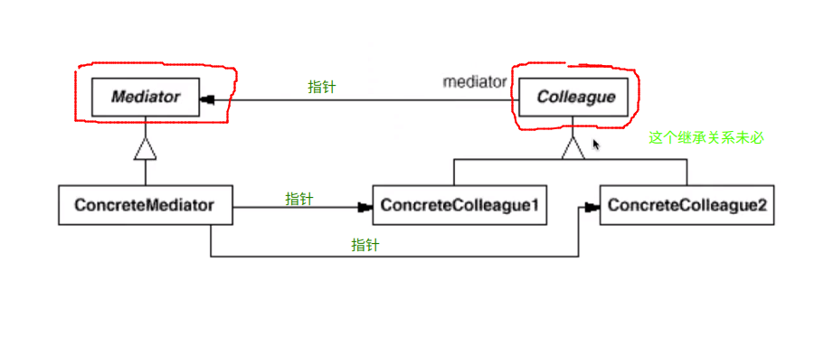
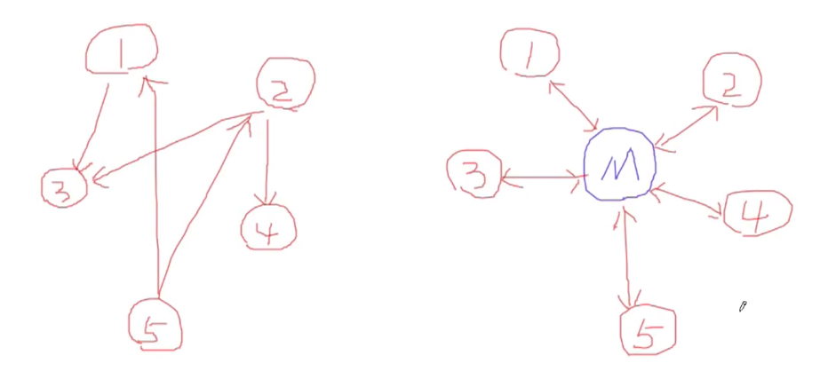

# Mediator 中介者模式

## 动机

* 在软件构建的过程当中，经常出现**多个对象**互相关联交互的情况，对象之间常常会维持一种复杂的引用关系，如果遇到一些需求的根共，这种直接的引用关系将面临不断的变化
* 在这种情况下，我们可以使用一个“中介对象”来管理对象间的关联关系，避免相互交互的对象之间的紧耦合引用关系，从而更好的抵御变化

## 模式定义

* 用一个中介对象来封装（封装变化）一系列的对象交互。中介者使得各个对象之间不需要显式的相互引用（编译时依赖 $\rightarrow$ 运行时依赖），从而使得耦合松散（管理变化），而且可以独立地改变它们之间的交互。
* 中介者模式可以认为是依赖倒置原则（A依赖 B $\rightarrow$ A  依赖抽象接口 I，B 依赖抽象接口 I）的一种扩展。这里不再是两个类之间的依赖关系，而是多个类之间的相互依赖关系，那么这里的中介者就类似于 I

## 例子

```c++
#include <iostream>
using namespace std;

#define SAFE_DELETE(p) if (p) { delete p; p = NULL; }

class Mediator;	/**这是一个中介者接口，负责各个实例类之间的交互过程*/

/**
 * 是实例类的接口
*/
class Colleague
{
public:
	Colleague(Mediator *pMediator) : m_pMediator(pMediator){}

	virtual void Send(wchar_t *message) = 0;

protected:
	/**
	 * 关键
	*/
	Mediator *m_pMediator;	/*接口中存储中介对象的接口*/
};

class ConcreteColleague1 : public Colleague
{
public:
	ConcreteColleague1(Mediator *pMediator) : Colleague(pMediator){}

	void Send(wchar_t *message);

	void Notify(wchar_t *message)
	{
		wcout<<message<<endl;
	}
};

class ConcreteColleague2 : public Colleague
{
public:
	ConcreteColleague2(Mediator *pMediator) : Colleague(pMediator){}

	void Send(wchar_t *message);

	void Notify(wchar_t *message)
	{
		cout<<"ConcreteColleague2 is handling the message."<<endl;
		wcout<<message<<endl;
	}
};

/**
 * 中介者的接口
*/
class Mediator
{
public:
	virtual void Sent(wchar_t *message, Colleague *pColleague) = 0;
};

class ConcreteMediator : public Mediator
{
public:
	// The mediator forward the message
	 void Sent(wchar_t *message, Colleague *pColleague)
	{
		ConcreteColleague1 *pConcreteColleague1 = dynamic_cast<ConcreteColleague1 *>(pColleague);
		/**
		 * 动态类型转化会进行类型的检测，如果 pColleague 的实际类型是 ConcreteColleague1 类型，那么可以转化成功
		 * 否则的话，返回 NULL
		*/
		if (pConcreteColleague1)
		{
			/**ConcreteColleague1 给 ConcreteColleague2 发送消息*/
			cout<<"The message is from ConcreteColleague1. Now mediator forward it to ConcreteColleague2"<<endl;
			if (m_pColleague2)
			{
				m_pColleague2->Notify(message);
			}
		}
		else
		{
			/*ConcreteColleague2 给 ConcreteColleague1 发送消息*/
			if (m_pColleague1)
			{
				m_pColleague1->Notify(message);
			}
		}
	}

	void SetColleague1(Colleague *pColleague)
	{
		m_pColleague1 = dynamic_cast<ConcreteColleague1 *>(pColleague);
	}

	void SetColleague2(Colleague *pColleague)
	{
		m_pColleague2 = dynamic_cast<ConcreteColleague2 *>(pColleague);
	}

private:
	/**
	 * 关键：
	 * Mediator 要有能力联系到所有的相互关联的对象
	*/
	ConcreteColleague1 *m_pColleague1;
	ConcreteColleague2 *m_pColleague2;
};
/**
 * 实际当中，相互交互的类可能不止有两种，另外两者之间的交互也不仅仅是简单的消息传递的过程
 * 上面的例子用两个类简单的说明其原理
 * 实际当中相互交互的类，往往没有共同的接口
*/

void ConcreteColleague1::Send(wchar_t *message)
{
	/**
	 * 第二个参数告诉了中介者，消息来自于哪里
	*/
	m_pMediator->Sent(message, this);
}

void ConcreteColleague2::Send(wchar_t *message)
{
	m_pMediator->Sent(message, this);
}

int main()
{
	 // Create the mediator
	 Mediator *pMediator = new ConcreteMediator();

	 Colleague *pColleague1 = new ConcreteColleague1(pMediator);
	 Colleague *pColleague2 = new ConcreteColleague2(pMediator);

	 ConcreteMediator *pConcreteMediator = dynamic_cast<ConcreteMediator *>(pMediator);
	 pConcreteMediator->SetColleague1(pColleague1);
	 pConcreteMediator->SetColleague2(pColleague2);

	 wchar_t message[260] = L"Where are you from?";
	 pColleague1->Send(message);

	 return 0;
}
```


## 结构

* GoF23 中定义的结构：



* 更加一般的情况：



## 要点总结

1. 将多个对象间复杂的关联关系解耦，Mediator模式将多个对象间的控制逻辑进行集中管理，变“多个对象相互关联”为“多个对象和一个中介者关联”，简化了系统的维护，抵御了可能的变化
2. 随着控制逻辑的复杂化，Mediator具体对象的实现可能相当复杂，这时候可以对 Mediator 对象进行分解处理
3. Facade 模式是解耦系统间（单向）的对象关联关系；Mediator 模式是解耦系统内的各个对象之间（双向）的关联关系