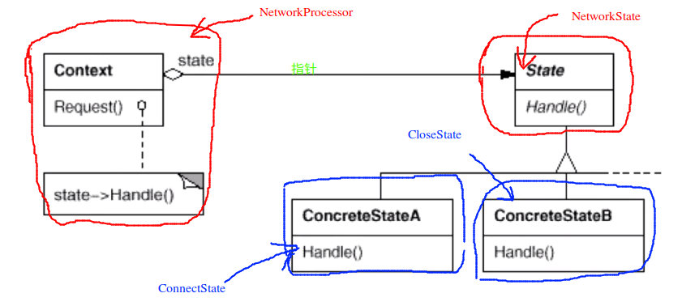

# State 状态模式

## “状态变化”模式

* 在组件构建的过程中，某些对象的状态经常面临变化，如何对这些变化进行有效的管理？同时维护高层模块的稳定？“状态变化”模式为这一问题提供了一种解决方案
* 典型模式
  * State
  * Memento

## 动机

* 在软件构建的过程当中，某些对象的状态如果改变，其行为也会随之发生变化，比如文档处在只读的状态，其支持的行为和读写状态支持的行为就可能完全不同
* 如何在运行时根据对象的状态来透明地更改对象的行为？而不会为对象操作和状态转化之间引入紧耦合？

## 模式定义

* 允许一个对象在其内部状态改变时改变它的行为。从而使对象看起来似乎修改了其行为

## 例子

> 考虑下面的问题

```c++
enum NetworkState
{
	Network_Open,
	Network_Closed,
	Network_Connect
	/**
	 * 如果这里面再增加状态的话，如何进行处理
	 * 例如 : Network_Wait
	*/
};

class NetworkProcessor{
	NetworkState state;
public:
	void operator1(){
		/**
		 * 操作会造成状态之间的转换
		 * 不同的操作，会造成不同逻辑的状态转换
		*/
		if (state == Network_Open)
		{
			// *****
			state = Network_Closed;
		}
		else if (state == Network_Closed)
		{
			// *****
			state = Network_Connect;
		}
		else if (state == Network_Connect)
		{
			// ******
			state = Network_Open;
		}
	}

	void operator2(){
		/**
		 * 另外一种状态的改变
		*/
		if (state == Network_Closed){
			// *******
			state = Network_Open;
		}
		else if (state == Network_Connect)
		{
			// *******
			state = Network_Closed;
		}
		else if (state == Network_Open){
			// *******
			state = Network_Connect;
		}
	}
};
```

> 对上面的代码进行重构

```c++
class NetworkState
{
public:
	NetworkState* pNext;
	virtual void Operator1() = 0;
	virtual void Operator2() = 0;
	virtual void Operator3() = 0;

	virtual ~NetworkState() {}
};

class OpenState : public NetworkState
{
	static NetworkState* m_instance;
public:
	static NetworkState* get_instance(){
		if (m_instance == nullptr){
			m_instance = new OpenState();
		}
		return m_instance;
	}

	virtual void Operator1(){
		// *******
		pNext = CloseState::get_instance();
	}

	virtual void Operator2(){
		// *******
		pNext = ConnectState::get_instance();
	}

	virtual void Operator3(){
		// ******
		pNext = OpenState::get_instance();
	}
};

class CloseState : public NetworkState
{
	static NetworkState* m_instance;
public:
	static NetworkState* get_instance(){
		if (m_instance == nullptr){
			m_instance = new CloseState();
		}
		return m_instance;
	}

	virtual void Operator1(){
		// ********
		pNext = ConnectState::get_instance();
	}

	virtual void Operator2(){
		// *******
		pNext = OpenState::get_instance();
	}

	virtual void Operator3(){
		// ******
		pNext = CloseState::get_instance();
	}
};

class ConnectState : public NetworkState
{
	static NetworkState* m_instance;
public:
	static NetworkState* get_instance(){
		if (m_instance == nullptr){
			m_instance = new CloseState();
		}
		return m_instance;
	}

	virtual void Operator1(){
		// ********
		pNext = OpenState::get_instance();
	}

	virtual void Operator2(){
		// *******
		pNext = CloseState::get_instance();
	}

	virtual void Operator3(){
		// ******
		pNext = ConnectState::get_instance();
	}
};

/**
 * 如果这个时候我们增加了一个状态 Network_Wait
*/
// 扩展（变化的部分）
class WaitState : public NetworkState{
	/* 实现相应的方法就可以了，其他的地方不需要进行任何的变化*/
};

/*稳定*/
class NetworkProcessor{
	NetworkState* pState;
public:
	NetworkProcessor(NetworkState* state){
		this->pState = state;
	}

	void Operator1(){
		// *******
		pState->Operator1();
		pState = pState->pNext;	/*这里实现了状态的转换*/
		// *******
	}

	void Operator2(){
		// *******
		pState->Operator2();
		pState = pState->pNext;	/*这里实现了状态的转换*/
		// *******
	}

	void Operator3(){
		// *******
		pState->Operator3();
		pState = pState->pNext;	/*这里实现了状态的转换*/
		// *******
	}
};
```

## 结构



## 要点总结

* State 模式将所有与一个特定状态相关的行为都放入一个 State 的子类对象中，在对象状态切换时，切换相应的对象；但同时维持 State 的接口，这样实现了具体操作与状态转换之间的解耦
* 为不同的状态引入不同的对象使得状态转换变得更加明确，而且可以保证不会出现状态不一致的情况，因为转换是原子性的---即要么彻底转换过来，要么不转换
* 如果 State 对象没有实例对象，那么各个上下文可以共享同一个 State 对象，从而节省对象开销