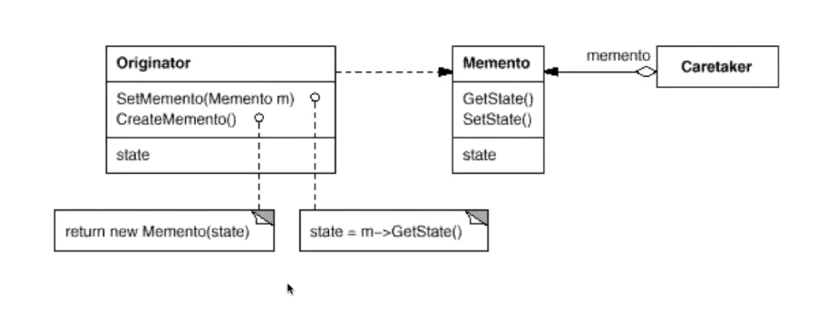

# Memento 备忘录模式

## 动机

* 在软件构建的过程中，某些对象的状态在转换的过程中，可能由于某种需要，要求程序能够回溯对象之前处于某个点的状。如果使用一些公共的接口来让其他对象得到对象的状态，便会暴露对象的实现细节
* 如何实现对象状态的良好的保护和恢复？同时不会因此破坏对象本身的封装特性

## 模式定义

* 在不破坏封装的前提下，捕获一个对象的内部的状态，并在该对象之外保存这个状态。这样以后就可以将该对象恢复到原先保存的状态

## 例子

```c++
#include <string>
using namespace std;
class Memento
{
	/**
	 * 这里的保存只是 一个简单的示例， 正式的快照可能采用一定编码方式对需要
	 * 保存快照的类的内容进行保存，可能是二进制的数据，也可能是字符串值，只要
	 * 可以恢复就可以了
	*/
	string state;
public:
	Memento(const string& s) : state(s) {}
	string getState() const { return state; }
	void setState(const string& s) { state = s; } 
};

class Originator
{
	/**
	 * 这个类拥有很多的状态需要进行保存
	*/
	string state;
	// ....
public:
	Originator() {}
	/**
	 * 我们需要在某些时刻对这个类的状态保存快照
	*/
	Memento createMemento() {
		Memento m (state);
		return m;
	}
	void setMemento(const Memento& m)
	{
		/**
		 * 这里也只是一个示例化的方法，正式的恢复的过程可能是从某种编码的二进制文件中恢复，
		 * 或者从某种字符串文件中进行恢复，序列化的技术 等等
		*/
		state = m.getState();
	}
};
/**
 * 这个模式本身很简单，难度在于使用什么方式保存快照，如果需要频繁的保存快照，可能就要考虑存储空间和内存开销方面的考虑，
 * 在快照的存储方式和编码方式上进行优化
*/
int main()
{
	Originator origin;

	// 存储到备忘录
	Memento mem = origin.createMemento();

	// 从备忘录中进行恢复
	origin.setMemento(mem);

}
```

> 在现代的编程语言当中，对对象快照的实现的方式已经不采用上面这种效率低下的方式。很多的编程语言的成熟的序列化的工具可以非常好的实现快照的保存（例如深度学习中对深度网络的保存和恢复的过程）

## 结构



## 要点总结

1. 备忘录存储原发器（Originator） 对象的内部状态，在需要时恢复原发器的状态
2. Memento 模式的核心时信息隐藏，即 Originator  需要向外部隐藏信息，保持其封装。但是同时又需要将状态保持到外界（Memento）
3. 由于现代语言运行时（C#， java 等）都具有相当的对象序列化支持，因此往往采用效率较高，又容易实现的序列化方案来实现 Memento 模式

