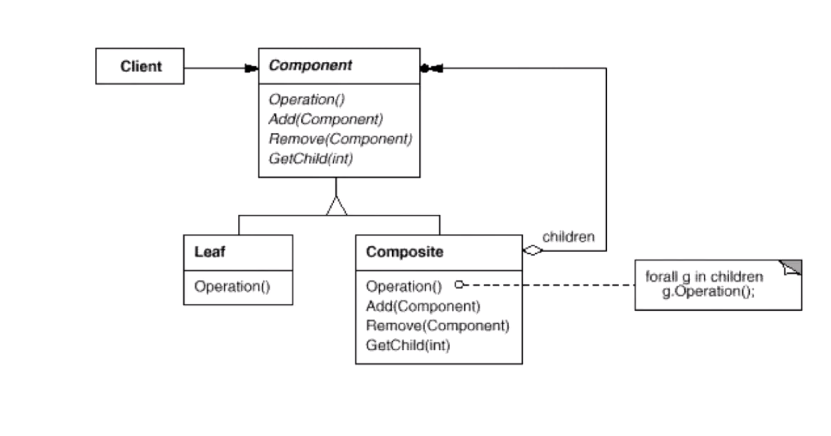

# Composite 组合模式

## “数据结构”模式

* 常常有一些组件在内部具有特定的数据结构，如果让客户依赖这些特定的数据结构，将极大的破坏组件的复用。这时候，将这些特定的数据结构封装在内部，在外部提供一个统一的接口，来实现与数据结构无关的访问，是一种行之有效的解决方法
* 典型模式
  * Composite
  * Iterator
  * Chain of Resposibility

## 动机

* 软件在某些情况下，客户代码过多的依赖于对象容器复杂的内部实现结构，对象容器内部结构（而非抽象结构）的变化将引起客户代码的频繁的变化，带来了代码维护性，扩展性变复杂的弊端
* 如何将“客户代码和复杂的对象容器结构”解耦？让对象容器自己来实现自身复杂的结构，从而时的客户代码就像处理简单的对象一样来处理复杂对象容器

## 模式定义

* 将对象组合成树形结构以表示“部分-整体”的层次结构。Composite 使得用户对单个对象和组合对象的使用具有一致性（稳定）

## 例子

```c++
#include <algorithm>
#include <string>
#include <list>
using namespace std;
class Componet
{
public:
	virtual void process() = 0;
	virtual ~Componet() {}
};

class Composite : public Componet
{
	string name;
	list<Componet*>	elements;
public:
	Composite(const string& s) : name(s) {}
	/**
	 * add() 和 remove() 方法没有放入 Componet 接口当中，因为
	 * 叶子节点没有必要实现这些功能
	*/
	void add(Componet* element) {
		elements.push_back(element);
	}
	void remove(Componet* element){
		elements.remove(element);
	}
	// 多态
	void process(){
		// process current node
		
		// process leaf node

		for (auto& e : elements)
		/**
		 * 使用树形的结构对叶子节点和非叶子节点进行分别的处理
		*/
			e->process();	// 多态的调用
	}
};

class Leaf : public Componet 
{
	string name;
public:
	Leaf(string s) : name(s) {}
	// 多态
	void process(){
		// process current node
	}
};

/**
 * 传入 Invoke() 函数的不论时什么类型都可以进行正确的处理
*/
void Invoke (Componet& c)
{
	// ....
	c.process();
	// ....
}
int main()
{
	Composite root("root");
	Composite treenode1("treenode1");
	Leaf leaf("leaf1");

	Invoke(root);
	Invoke(treenode1);
	Invoke(leaf);
}
```

## 结构



## 要点总结

1. Composite 模式采用树形的结构来实现普遍存在的对象容器，从而将“一对多”的关系转化为“一对一”的关系，使得客户代码可以一致地（复用）处理对象和对象容器，无需关系处理的时单个的对象，还是组合对象的容器
2. 将“客户代码与复杂的对象容器结构”解耦是 Composite 的核心思想。解耦之后，客户代码将于纯粹的抽象接口---而不是对象容器的内部实现结构---发生依赖，从而更能“应对变化”
3. Composite 模式在具体实现的中，可以让父对象中的子对象反向追溯；如果父对象有频繁的遍历的需求，可使用缓存技术来改善效率

