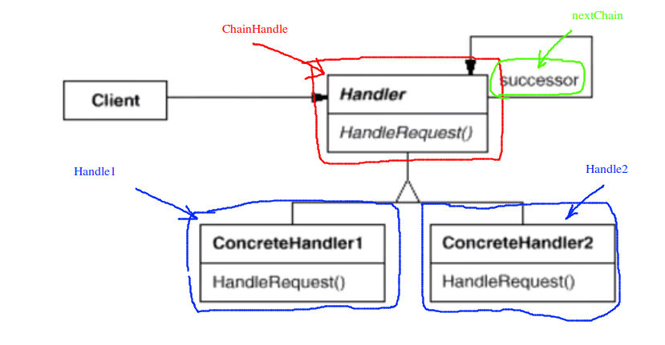

# Chain of Resposibility 职责链模式

## 动机

* 在软件构建的过程当中，一个请求可能被多个对象处理，但是每一个请求在运行时只能有一个接收者，如果显式的指定，将必不可少的带来请求发送者和接收者之间的紧耦合
* 如何使请求的发送者不需要指定具体的接收者？让请求的接收者自己在运行时决定来处理请求，从而使两者解耦

## 模式定义

* 使多个对象都有机会处理请求，从而避免请求的发送者和接收者之间的耦合关系。将这些对象形成一个链，并沿着链传递请求，直到有一个对象来处理该请求

## 例子

```c++
#include <iostream>
#include <string>

using namespace std;

enum class ResquestType
{
	REQ_HANDLER1,
	REQ_HANDLER2,
	REQ_HANDLER3
};

class Reqest
{
	string description;
	ResquestType  reqType;
public:
	Reqest(const string& desc, ResquestType type): description(desc), reqType(type) {}
	ResquestType getReqType() const { return this->reqType; }
	const string& getDescription() const { return this->description; }
};

class ChainHandler
{
	/**
	 * 一个多态的链表
	*/
	ChainHandler* nextChain;
	/**
	 * 自己处理不了，把请求送给链表的下一个对象
	*/
	void sendReqestToNoextHandler(const Reqest& req)
	{
		if (nextChain != nullptr)
			nextChain->handle(req);
	}

protected:
	/**
	 * 具体类应该实现这个方法
	*/
	virtual bool canHandleRequest(const Reqest& req) = 0;
	virtual void processRequest(const Reqest& req) = 0;
public:
	ChainHandler() { this->nextChain = nullptr; }
	void setNextChain(ChainHandler* next) { this->nextChain = next; }
	/**
	 * 整体的处理逻辑：如果我可以处理请求，我就进行处理；如果我处理不了的话，那么我们就将请求传递给下一个节点处理
	*/
	void handle(const Reqest& req)
	{
		if (canHandleRequest(req))
			processRequest(req);
		else 
			sendReqestToNoextHandler(req);
	}
};


class Handle1 : public ChainHandler
{
protected:
	bool canHandleRequest(const Reqest& req){
		/**
		 * 当然子类中判断是否处理请求有很多的方法，这里采用了一种简单的方式。
		 * 做一次简单的类型检查，类型匹配上就进行处理
		*/
		return req.getReqType() == ResquestType::REQ_HANDLER1;
	}
	void processRequest(const Reqest& req){
		cout << req.getDescription() << endl;	/*非常简单的处理逻辑，打印一行字符*/
	}
};


class Handle2 : public ChainHandler
{
protected:
	bool canHandleRequest(const Reqest& req){
		/**
		 * 当然子类中判断是否处理请求有很多的方法，这里采用了一种简单的方式。
		 * 做一次简单的类型检查，类型匹配上就进行处理
		*/
		return req.getReqType() == ResquestType::REQ_HANDLER2;
	}
	void processRequest(const Reqest& req){
		cout << req.getDescription() << endl;	/*非常简单的处理逻辑，打印一行字符*/
	}
};

class Handle3 : public ChainHandler
{
protected:
	bool canHandleRequest(const Reqest& req){
		/**
		 * 当然子类中判断是否处理请求有很多的方法，这里采用了一种简单的方式。
		 * 做一次简单的类型检查，类型匹配上就进行处理
		*/
		return req.getReqType() == ResquestType::REQ_HANDLER3;
	}
	void processRequest(const Reqest& req){
		cout << req.getDescription() << endl;	/*非常简单的处理逻辑，打印一行字符*/
	}
};

int main()
{
	Handle1 h1;
	Handle2 h2;
	Handle2 h3;
	h1.setNextChain(&h2);
	h2.setNextChain(&h3);

	Reqest req("process task ...", ResquestType::REQ_HANDLER2);
	h1.handle(req);
	return 0;
}
```

## 结构



## 要点总结

1. Chain of Responsibility 模式的应用场合在于“一个请求可能有多个接收者，但是真正的接收者只有一个”，这时候请求发送者于接收者的耦合有可能出现“变化脆弱”的症状，职责链的目的就是将二者解耦，从而更好的应对变化
2. 应用了 Chain of Responsibility 模式后，对象的职责分派将变得更具有灵活性。我们可以在**运行时动态添加/修改请求**的处理职责
3. 如果请求传递到请求链的末端仍得不到处理，应该有一个合理的缺省的机制。这也是每一个接收对象的责任，而不是发出请求的对象的责任

