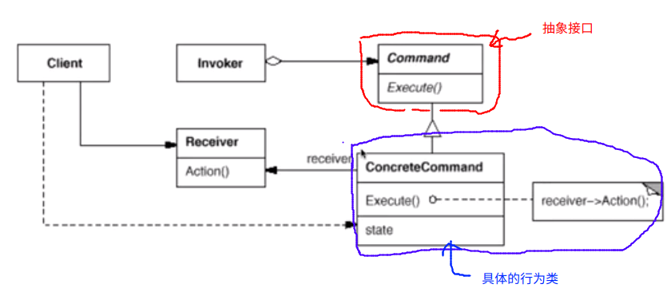

# Command 命令模式

“行为变化”模式

* 在组件的构建的过程中，组件行为的变化经常导致组件本身剧烈的变化。“行为变化”模式将组件的行为和组件本身进行解耦，从而支持组件行为的变化，实现两者之间的松耦合
* 典型模式
  * Command
  * Visitor

## 动机

* 在软件的构建过程中，“行为的请求者”与“行为实现者”通常呈现一种“紧耦合”。但是某些场景----比如需要对行为进行“记录，撤销/重做事务”等处理，这种无法抵御变化的紧耦合是不合适的
* 在这种情况下，如何将“行为的请求者”和“行为的实现者”解耦？将一组行为抽象为对象，可以实现二者之间的松耦合

## 模式定义

* 将一个请求（行为）封装为一个对象，从而使你可用不同的请求对客户进行参数化；对请求排队或记录请求日志，以及支持可撤销的操作

## 例子

```c++
#include <string>
#include <iostream>
#include <vector>
using namespace std;


class Command
{
public:
	virtual void execute() = 0;
};

/**
 * 所有继承自 Command 的对象就是一个行为对象
 * 这个对象表征一个行为 ： 比如厨师做饭
*/
class ConcreteCommand1 : public Command
{
	string args;
public:
	ConcreteCommand1(const string& a) : args(a) {}
	void execute() override
	{
		cout << "#1 process ..." << args << endl;
	}
};

/**
 * 这个类代表了另一个行为 ： 比如厨师烧汤
*/
class ConcreteCommand2 : public Command
{
	string args;
public:
	ConcreteCommand2(const string& a) : args(a) {}
	void execute() override
	{
		cout << "#2 process ..." << args << endl;
	}
};

/**
 * 这里 也使用了 Composite 设计模式
 * 这个类相应的可以看作是服务员，我们所有的请求只要告诉服务员就可以了，不管是做饭还是烧汤
*/
class MacroCommand : public Command
{
	vector<Command*>	commands;
public:
	void addCommand(Command* c) { this->commands.push_back(c); }
	/**
	 * 服务员去和厨师进行沟通
	*/
	void execute() override
	{
		for (auto &c : this->commands)
			c->execute();
	}
};

int main()
{
	ConcreteCommand1 command1("Args ###");
	ConcreteCommand2 command2("Args $$$");
	MacroCommand macro;
	macro.addCommand(&command1);
	macro.addCommand(&command2);
	macro.execute();
}
```

## 结构



## 要点总结

1. Command 模式的根本目的在于将“行为请求者”于“行为实现者”解耦，在面向对象语言中，常见的实现手段是“将行为抽象为对象”
2. 实现 Command 接口的具体命令对象 ConcreteCommand 有时候根据需要可能会保存一些额外的状态信息。通过使用 Composite 模式可以将多个“命令”封装为一个“复合命令”MacroCommand
3. Command 模式与C++ 中的函数对象有些类似。但是两者定义行为接口的规范有所区别：Command 以面向对象中的“接口-实现”来定义行为接口规范，更加的严格，但是有性能的损失；C++ 函数对象以函数签名来定义行为接口规范，更灵活，性能更高


