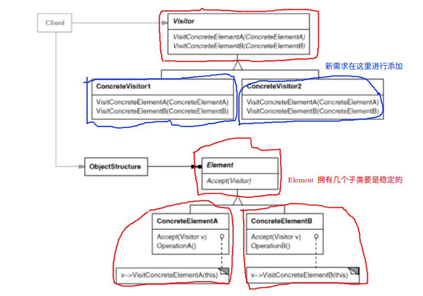

# Visitor 访问器模式

## 动机

* 在软件构建的过程中，由于需求的改变，某些类层次结构中常常需要增加新的行为（方法），如果直接在基类中进行修改，将会给子类带来很繁重的变更负担，设置破坏原有的设计
* 如何在不更改层次结构的前提下，在运行时根据需要透明地为类层次结构上的各个类动态添加新的操作，从而避免上述的问题？

## 模式定义

* 表示一个作用于某个对象结构中的各个元素的操作。使得可以在不改变（稳定）各元素的类的前提下定义（扩展）作用于这些元素的新操作（变化）

## 例子

```c++
class Visitor;

class Element 
{
public:
    virtual void accept(Visitor& Visitor) =  0; // 第一次动态辨析

    virtual ~Element() {}
};

class ElementA : public Element
{
public:
    void accept(Visitor& visitor) override{
        visitor.visitElementA(*this);   // 第二次动态辨析
    }
};

class ElementB : public Element
{
public:
    void accept(Visitor& visitor) override{
        visitor.visitElementB(*this);
    }
};

/**
 * Visitor 应该要可以访问 Element 以及其子类 ElementA 和 ElementB 的所有的数据
 * 否则不能保证可以实现相对应的功能
*/
class Visitor{
public:
    virtual void visitElementA(ElementA& Element) = 0;
    virtual void visitElementB(ElementB& Element) = 0;
    virtual ~Visitor() {}
};

// ============== 以上的部分都是稳定的，所有的需求变化的部分都在下面进行实现

/**
 * ElementA 和 ElementB 新添加的操作
 * 这些操作相当于在 visitor1.cpp 中在 Element 基类中添加操作
*/
class Visitor1 : public Visitor
{
public:
    void visitElementA(ElementA& element) override
    {
        // 针对 elementA 进行操作
    }

    void visitElementB(ElementB& element) override
    {
        // 针对 elementB 进行操作
    }
};

/**
 * 添加新的操作
*/
class Visitor2 : public Visitor
{
public:
    void visitElementA(ElementA& element) override
    {
        // 针对 elementA 进行操作
    }

    void visitElementB(ElementB& element) override
    {
        // 针对 elementB 进行操作
    }
};

int main()
{
    Visitor2 visitor;   /*添加新的需求*/
    ElementB elementB;
    elementB.accept(visitor);   // double dispatch 

    ElementA elementA;
    elementA.accept(visitor);
}
```

## 结构



## 要点总结

1. Visitor 模式通过所谓的双重分发（double dispatch） 来实现在不更改（不添加新的操作--编译时） Element 类的层次结构的前提下，在运行时透明地为类层次结构上的各个类动态的添加新的操作（支持变化）。
2. 所谓的双重分发就是指 Visitor 模式中间包括了两个多态的分发（注意其中的多态机制）：第一个为 accept 方法的多态辨析；第二个为 visitElementX 方法的多态辨析
3. Visitor 模式的最大的缺点就是不能扩展类的层次结构（增添新的 Element 子类），会导致 Visitor 类的变化。因此 Visitor模式适用于“Element类的层次结构稳定，而其中的操作却经常面临频繁的改动”

