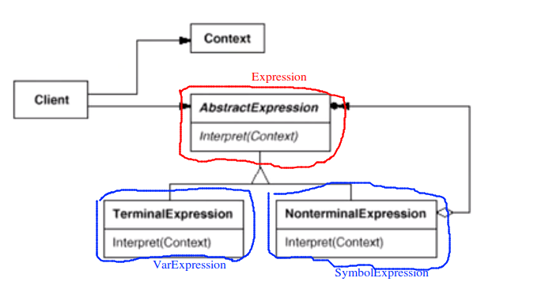

# Interpreter 解析器模式

## “领域规则”模式

* 在特定的领域当中，某些变化虽然频繁，但可以抽象为某种规则。这时候，结合特定的领域，将问题抽象为语法规范，从而给出在该领域下的一般性解决方案
* 典型模式
  * Interpreter

## 动机

* 在软件构建的过程中，如果某一些特定领域的问题比较复杂，类似的结构不断重复出现，如果使用普通的编程方式来实现将面临非常频繁的变化
* 在这种情况下， 将特定领域的问题表达为某种语法规则下的句子，然后构建一个解释器来解释这样的句子，从而达到解决问题的目的

## 模式定义

* 给定一个语言，定义它的文法的一种表示，并定义一种解释器，这个解释器使用该表示来解释语言中的句子

## 例子

> 举一个进行加减运算的例子，加减运算的符号表达式可能很长，但是总是可以分成一个部分加上或者减去另一个部分

```c++
#include <iostream>
#include <map>
#include <stack>
using namespace std;

/**
 * 总的表达时的基类
*/
class Expression{
public:
	virtual int interpreter(map<char, int>& var) = 0;
	virtual ~Expression() {}
};


// 变量表达式
/**
 * 变量表达式的解析过程就是返回自己的值
*/
class VarExpression : public Expression
{
	char key;
public:
	VarExpression(const char& key){
		this->key = key;
	}

	int interpreter(map<char, int>& var) override{
		return var[key];
	}
};

// 符号表达时
/**
 * 符号表达时用于存储二目运算符参与运算的双方的变量表达式
*/
class SymbolExpression : public Expression 
{
protected:
	Expression* left;
	Expression* right;

public:
	SymbolExpression(Expression* left, Expression* right)
		: left(left), right(right)
	{}
};

// 加法运算
class AddExpression : public SymbolExpression
{
public:
	AddExpression(Expression* left, Expression* right):
		SymbolExpression(left, right)
	{}

	int interpreter(map<char, int>& var) override
	{
		return left->interpreter(var) + right->interpreter(var);
	}
};


// 减法运算
class SubExpression : public SymbolExpression
{
public:
	SubExpression(Expression* left, Expression* right):
		SymbolExpression(left, right)
	{}

	int interpreter(map<char, int>& var) override
	{
		return left->interpreter(var) - right->interpreter(var);
	}
};

/**
 * 语句解释 将语句解释为一个个的模块
*/
Expression* analyse(string expStr)
{
	stack<Expression*> expstack;
	Expression* left = nullptr;
	Expression* right = nullptr;

	for (int i = 0; i < expStr.size(); ++i){
		switch(expStr[i])
		{
			case '+':
				left = expstack.top();
				right = new VarExpression(expStr[++i]);
				expstack.push(new AddExpression(left, right));
				break;
			case '-':
				left = expstack.top();
				right = new VarExpression(expStr[++i]);
				expstack.push(new SubExpression(left, right));
				break;
			default:
				expstack.push(new VarExpression(expStr[i]));
		}
	}
	Expression* expression = expstack.top();
	return expression;
}

int main()
{
	string expStr = "a+b-c+d";
	map<char , int> var;
	var.insert(make_pair('a', 5));
	var.insert(make_pair('b', 2));
	var.insert(make_pair('c', 1));
	var.insert(make_pair('d', 6));

	Expression* expression = analyse(expStr);
	int result = expression->interpreter(var);
	cout << result << endl;
	return 0;
}
```

## 结构



## 要点总结

1. Interpreter模式的应用场合是 Interpreter 模式应用中的难点，只有满足“**业务规则频繁变化，且类似的结构不断重复出现，并且容易抽象为语法规则的问题**”才适合使用 Interpreter 模式
2. 使用Interpreter 模式来表示文法规则，从而可以使用面向对象技巧来方便地扩展文法
3. Interpreter模式比较适合于简单的文法表示，对于复杂的文法表示，Interpreter 模式会产生比较大的类层次结构，需要求助于语法分析生成器这样的标准工具

