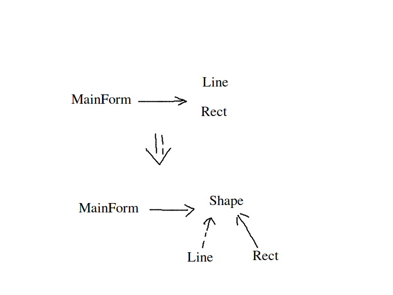

# 面向对象的设计

## 重新认识面向对象

面向对象的设计的重要作用就是可以抵御变化

* 理解隔离变化
  * 从宏观层面来看，面向对象的构建方式可以更加适应软件的变化，能将变化带来的影响减为最小
* 合司其职
  * 从微观的层面来看，面向对象的方式更强调各个类的责任
  * 由于需求的变化导致的新增的类型不应该影响已有类型的实现
* 对象是什么
  * 从语言实现的层面来看，对象封装了代码和数据
  * 从规格来看，对象是一系列的可以被使用的公共接口
  * 从概念上讲，对象是某种拥有责任的抽象
* 依赖倒置原则（DIP）
  * 高层代码（稳定）不应该依赖底层的模块（变化），二者都应该依赖于抽象（稳定）。
  * 抽象（稳定）不应该依赖于实现细节（变化），实现细节应该依赖抽象（稳定）。

* 开放封闭原则（OCP）
  * 对扩展开放，对更改封闭
  * 类模块应该是可扩展的，但是不可修改的

* 单一职责原则（SRP）
  * 一个类应该仅有一个引起它变化的原因
  * 变化的方向隐含着类的责任

* Liskov 替换原则（LSP）
  * 子类必须能够替换它们的基类（IS-A）
  * 继承表达类型抽象
* 接口隔离原则（ISP）
  * 不应该强迫客户程序依赖他们不使用的方法
  * 接口应该小而完备
* 优先使用对象组合，而不是类的继承
  * 类的继承通常是“白箱复用”，而类的对象组合通常是“黑箱复用”
  * 继承在某种程度上破坏了封装性，子类和父类的耦合度高
  * 而对象的组合则只要求被组合的对象具有良好的接口的的定义，耦合度低
* 封装变化点
  * 使用封装来创建对象之间的分界层，让设计者可以在分界层的一侧进行修改，而不会对另一侧产生不良的影响，从而实现封装之间的松耦合
* 针对接口编程，而不是针对实现编程
  * 不将变量类型声明为莫一个特定的具体的类，而是声明为某一个接口
  * 客户程序不需要知道对象的具体的内容，只需要知道对象所具有的接口
  * 减小系统中各个部分的依赖，实现“高内聚，松耦合”的类型设计方案

## 面向接口设计

产业强盛的标志：接口的标准化

## 将设计原则提升为设计经验

1. 设计习语
   * 描述与特定的编程语言相关的底层模式，和习惯用法
2. 设计模式
   * 主要描述的是 "类与相互通信对象之间的组织关系，包括它们的角色，职责，协作方式等方面"
3. 架构模式
   *  描述系统中的与基础结构组织关系密切的高层模式，包括子系统的划分，职责，以及如何组织它们之间关系的规则