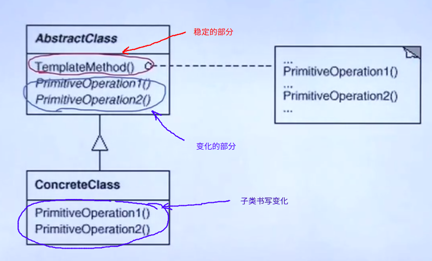

# 模板方法

## GOF-23 模式分类

1. 从目的来看：

    * 创建型模式：主要解决的是对象创建的工作
    * 结构型模式：通过类的继承或者类的组合获得灵活的结构，从而应对需求变化对对象的结构带来的冲击
    * 行为型模型：应对需求变化对多个交互对象的冲击
2. 从范围来看：
    * 类模式处理类与子类之间的静态关系（偏向于继承的方案）
    * 对象模式处理对象间的动态的关系（偏向于组合方案）

## 从封装变化的角度对模式进行分类

1. 组件协作
   * Template Method
   * Strategy 
   * Oberver / Event
2. 单一职责
   * Decorator
   * Bridge
3. 对象创建
   * Factory Method
   * Abstract Factory
   * Prototype
   * Builder
4. 对象性能
   * Singleton
   * FlyWeight
5. 接口隔离
   * Facade
   * Proxy
   * Mediator
   * Adapter
6. 状态变化
   * Memento
   * State
7. 数据结构
   * Composite
   * Iterator
   * Chain of Resposibility
8. 行为变换
   * Command
   * Vsistor
9. 领域问题
   * Interpreter

## 重构获得模式 Refactoring to Patterns

* 好的面向对象的设计，指的是那些可以满足 “应对变化，提高复用“ 的设计
* 现代软件设计的特征是 “需求的频繁的变化”。设计模式的要求就是 “寻找变化点”，然后在变化的地方使用设计模式。在什么时候和什么地方使用设计模式比理解设计模式本身更加的重要

* 不要一开始就尝试使用某一种模式。推荐的方法就是通过重构来获得模式。在软件的设计当中，一开始设计的代码可能具有很大的问题，在对问题进行分析，对代码进行重构之后，可以获得一个可以有效的应对变化的好的设计，实际上你自然就在其中使用了某些模式

## 重构的关键技法

* 静态 $\rightarrow$ 动态
* 早绑定 $\rightarrow$ 晚绑定
* 继承 $\rightarrow$ 组合
* 编译时依赖 $\rightarrow$ 运行时依赖
* 紧耦合 $\rightarrow$ 松耦合

## <font color=red>“组件协作” 模式</font>

现代软件专业分工后的一个结果就是 “框架和应用程序的划分”。“组件协作” 模式通过晚绑定，来实现框架之间的松耦合，是两者之间协作的常用的模式

* Template Method
* Strategry
* Observer / Event


## Template Method 模式

### 动机

> 在软件的设计过程当中，对于某一个具体的任务，它常常具有**稳定的结构**，但是对于每一个**子步骤有需要变换的需求**
>
> 如何在确定了一个稳定的结构的情况下，来灵活的应对每一个子步骤的变化，或者晚期的实现需求？

```c++
// template1.cpp
// 程序库的开发
class Library
{
public:
    void step1(){
        //...
    }
    void step3(){
        //...
    }
    void step5(){
        //...
    }
};
// 在程序库中提供了某几个流程
```

```c++
//template1_app.cpp
class Aplication{
public:
    void step2();
    void step4();
};
// 在应用程序当中另外添加了几个流程

int main()
{
    Library lib();
    Application app();
    lib.step1();
    if (app.step2())
        lib.step3();
    app.step4();
    //在我们的主程序中，我们需要将我们的库以及自己书写的 application 中的流程组合起来完成一个大的工作
}
```

> 上面的代码是一种实现的方法

```c++
// template2.cpp
class Library
{
public:
    ~Library();
    void run()	// 整个 run() 的步骤是稳定的，但是里面的某些小的步骤step2() step4() 是变化的
    {
       	step1();
    	if (step2())	// 虚函数  ==> 支持变化，调用子类的重写实现
        	step3();
        step4();	// 虚函数  ==> 支持变化，调用子类的重写实现
    }
protected:
    void step1();	//稳定
    void step3();	//稳定
    void step5();	//稳定
    
    virtual void step2() = 0;	//变化
    virtual void step4() = 0;	//变化
};
```

```c++
//template2_app.cpp
class Application : public Library
{
protected:
    void step2(){}	// 子类进行重写实现
    void step4(){}	// 子类进行重写实现
};

int main()
{
    Library* pLib = new Application();
    plib->run();
}
```

### 模式的定义

一个操作的骨架（run() ）是稳定的,但是其中的一些步骤是不稳定的，因此将这些变化的步骤延时到子类中。 Template Method 使得子类可以不改变一个（复用）的算法的结构，就可以实现其中的某些步骤的变化



### 总结要点

1. 除了可以应对灵活的子步骤的变化以外。“不要调用我，我来调用你” 的反向控制结构也是 Template Method 的一个典型的应用