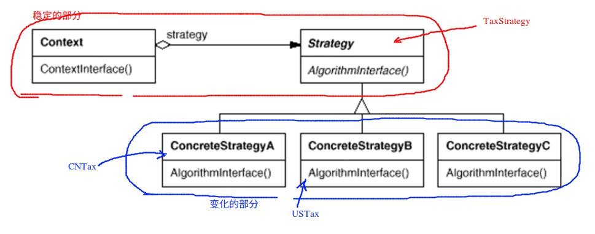

# 策略模式

## 动机

> 在软件构建的过程当中，某些对象使用的算法可能多种多样，其中的方法的实现还需要经常的改变，如果把这些算法全部都编码到我们的对象当中，那么将这个对象变得非常的复杂，而且会加重对象使用当中的负担

```c++
// strategy1.cpp
enum TaxBase
{
  	CN_tax;
  	US_tax;
    DE_tax;
};

class SalesOrder
{
	TaxBase tax;
public:
    double calculateTax()
    {
        if (tax == CN_tax)
            //CN**********
        else if (tax == US_tax)
            //US**********
       	else if (tax == DE_tax)
            //DE**********
        //***
    }
};

// 上面的代码，如果我们需要支持更多的国家的时候，那么需要更改上面两种数据结构中的大量的内容
```

* 下面的代码使用了策略模式

```c++
//strategy2.cpp
class TaxStrategy
{
public:
    virtual double Calculate(const Context& context) = 0;
    ~virtual TaxStrategy();
};

class CNTax : public TaxStrategy
{
public:
    double Calculate(const Context& context){
        //***************
    }
};

class USTax : public TaxStrategy
{
public:
    double Calculate(const Context& context){
        //***************
    }
};

class DETax : public TaxStrategy
{
public:
    double Calculate(const Context& context){
        //***************
    }
};

// 扩展  如果此时需求发生了变化，要求我们需要支持 FR 的业务
//**************
class FRTax : public TaxStrategy
{
public:
    double Calculate(const Context& context){
        //***************
    }
};


class SalersOrder
{
private:
    TaxStrategy* strategy;	// 多态
public:
    SalesOrder(StrategyFactory* strategyFactory)	// 工厂模式
    {
        strategy = strategyFactory->newStrategy();
    }
    ~SalesOrder();
    
    double CalculateTax()
    {
        Context context();
        double val = strategy->Calculate(context);
    }
};
```



## 要点总结

1. strategy 以及其子类为组件提供了一系列的可重用的方法，从而可以使得类型在<font color=red>运行时</font>可以方便的根据需要在**各个算法之间进行切换**
2. strategy提供了一个 if else 以外的另一种选择，消除条件判断，其实就是在解耦和。如果**条件一直在变动**，就需要考虑一下 strategy 模式

<font color=red>使用扩展的方式来应对未来的算法层面的变化</font>