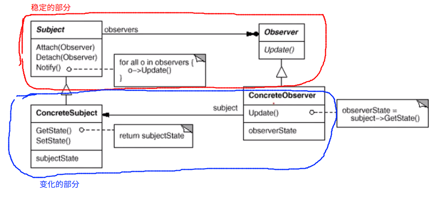

# Observer 观察者模式

## 动机

> 在软件构建的过程当中，我们需要为某一些对象建立一种通知依赖关系------一个对象的状态发生了变化，所有依赖的对象（观察者对象） 都会得到通知。如果这样的依赖的关系过于紧密，那么软件将不能很好的抵御需求的变化

> 使用面向对象的技术，可以使这种依赖的关系弱化，并形成一种稳定的依赖关系。从而实现软件体系结构的松耦合

```C++
//MainForm.cpp
class MainForm : public Form 
{
	TextBox*	textFilePath;
    TextBox* 	textFileNumber;

public:
    void Button1_click()
    {
       	filename = //*******
        number = //********
        FileSplitter splitter(filename, number);
        splitter.split();
    }
};
```

```c++
// FileSplitter.cpp
class FileSplitter
{
string m_filePath;
int m_filenumber;
    
public:
    FileSplitter(filepath, filenumber)
        : m_filePath(filepath),
    	m_filenumber(filenumber)
        {}
    
    void split()
    {
        // 1. 读取大文件
        // 2. 分批次向小文件中进行写入
        for (; i< m_filenumber; ++i)
        {
            //***********
        }
    }
};
```

这个时候，如果我们有一个需求。我们希望可以使用一个进度条来显示文件分割的进度。我们应该怎么对上面的过程进行改进？。下面是一种可能使用的方法

```c++
// MainForm.cpp
class MainForm : public Form 
{
	TextBox*	textFilePath;
    TextBox* 	textFileNumber;
	// 变动
    ProgressBar* processBar;
public:
    void Button1_click()
    {
       	filename = //*******
        number = //********
        FileSplitter splitter(filename, number， processBar);
        splitter.split();
    }
};
```

```c++
// FileSplitter.cpp
class FileSplitter
{
string m_filePath;
int m_filenumber;
// 变化
ProgressBar* m_progressBar;	// 具体通知控件

public:
    FileSplitter(filepath, filenumber, bar)
        : m_filePath(filepath),
    	m_filenumber(filenumber),
    	// 变化
    	m_progressBar(bar)
        {}

    void split()
    {
        // 1. 读取大文件
        // 2. 分批次向小文件中进行写入
        for (; i< m_filenumber; ++i)
        {
            //***********
            
            //变化
            m_progressBar->setValue(******);
        }
    }
};
```

上面的这种方法当然可以实现，但是有很多的问题。上面的设计方法违背了一些设计原则，比如说，依赖倒置原则。高层的模块不可以依赖于低层的模块，而应该依赖于抽象

上面的 progressBar 就是一个依赖关系。比方说，今天我想使用进度条的方式来实现显示进度，但是明天可能我希望直接显示 百分比的方式显示进度，甚至有可能上面的软件要求在终端上进行运行，在终端上使用打点的方式显示进度，那么上面部分的代码全部需要改变

**上面的进度条可以抽象为通知类型，通知有不同的实现的方式。所以我们使用一个抽象的基类来表示我们的通知**

```c++
// FileSplitter.cpp

// 抽象的基类
class IProgress
{
public:
    virtual void DoProgress(float ) = 0;
    virtual ~IProgress();
};

class FileSplitter
{
string m_filePath;
int m_filenumber;
// 变化
//ProgressBar* m_progressBar;	// 具体通知控件
IProgress* m_iprogress;	// 抽象的接口

public:
    FileSplitter(filepath, filenumber, iprogress)
        : m_filePath(filepath),
    	m_filenumber(filenumber),
    	// 变化
    	m_iprogress(iprogress)
        {}

    void split()
    {
        // 1. 读取大文件
        // 2. 分批次向小文件中进行写入
        for (; i< m_filenumber; ++i)
        {
            //***********
            
            //变化
            m_iprogress->DoProgress(******);
        }
    }
};
```

```c++
// MainForm.cpp
class MainForm : public Form,public IProgress	// 继承这个通知抽象接口
{
	TextBox*	textFilePath;
    TextBox* 	textFileNumber;
	// 变动
    ProgressBar* processBar;	// 它就是一个观察者
public:
    void Button1_click()
    {
       	filename = //*******
        number = //********
        FileSplitter splitter(filename, number， this);	// 注意这里传递的参数，因为 MainForm 类实现了 IProgress 接口，因此将自身传递给 FileSplitter 对象
        splitter.split();
    }
    
    // 实现抽象接口的抽象方法
    virtual void DoProgress(float ){
        processBar->setValue(......);
    }
};
```

上面的方法已经是一个非常好的解决方案，但是如果我们同时具有多个观察者，既有进度条，又有控制台终端的显示输出，应该如何来做呢？

```C++
// FileSplitter.cpp

// 抽象的基类
class IProgress
{
public:
    virtual void DoProgress(float ) = 0;
    virtual ~IProgress();
};

class FileSplitter
{
    string m_filePath;
    int m_filenumber;
    // 变化
    //ProgressBar* m_progressBar;	// 具体通知控件
    vector<IProgress*> m_iprogressVector;	// 抽象的接口,支持多个观察者
    /**
    * 上面的这一行是整个设计过程中的关键
    */

public:
    FileSplitter(string filepath, int filenumber)
        : m_filePath(filepath),
    	m_filenumber(filenumber)
        {}

    void add_IProgress(IProgress* iprogress){
        m_iprogressVector.push_back(iprogress);
    }

    void remove_IProgress(IProgress* iprogress){
        m_iprogressVector.remove(iprogress);
    }

    void split()
    {
        // 1. 读取大文件
        // 2. 分批次向小文件中进行写入
        for (int i =  0; i< m_filenumber; ++i)
        {
            //***********
            
            //变化
            float progressValue = m_filenumber;
            progressValue = (i + 1) / progressValue;
            onProgress(progressValue);
        }
    }

protected:
    void onProgress(float value){
        vector<IProgress*>::iterator iter = m_iprogressVector.begin();

        while(iter != m_iprogressVector.end()){
            (*iter)->DoProgress(value); //更新进度条
            ++iter;
        }
    }
};
```

```c++
// MainForm.cpp
class MainForm : public Form,public IProgress	// 继承这个通知抽象接口
{
	TextBox*	textFilePath;
    TextBox* 	textFileNumber;
	// 变动
    ProgressBar* processBar;	// 它就是一个观察者
public:
    void Button1_click()
    {
       	filename = //*******
        number = //********
        ConsoleNotifier cn;
        FileSplitter splitter(filename, number);

        splitter.add_IProgress(this);	// 订阅通知
        splitter.add_IProgress(&cn);	// 订阅通知

        splitter.split();

        splitter.remove_IProgress(this);
    }
    
    // 实现抽象接口的抽象方法
    virtual void DoProgress(float value){
        processBar->setValue(value);
    }
};

class ConsoleNotifier : public IProgress{
public:
    virtual void DoProgress(float value){
        cout << ".";
    }
};
```

## 模式定义

定义了对象间的一种**一对多**（变化）的依赖关系，以便于当一个对象（subject）的状态发生改变的时候，___所有的依赖于它的对象都可以得到通知___，并自动更新



## 要点总结

1. 使用面向对象的抽象，Observer 模式使得我们可以**独立的改变目标和观察者**，从而是两者之间的关系达到松耦合
2. 目标发送通知时，无需指定观察者，通知（可以携带通知信息作为参数）会自动传播
3. 观察者自己决定是否需要订阅通知，目标对象对此一无所知
4. Observer 模式时基于事件的 UI 框架中非常常用的设计模式，也是 MVC模式的一个重要的组成部分


