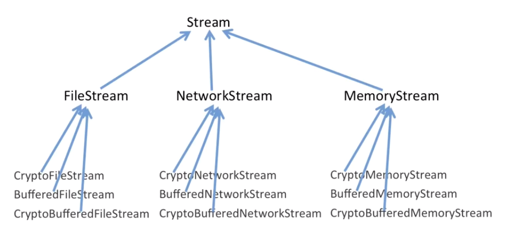
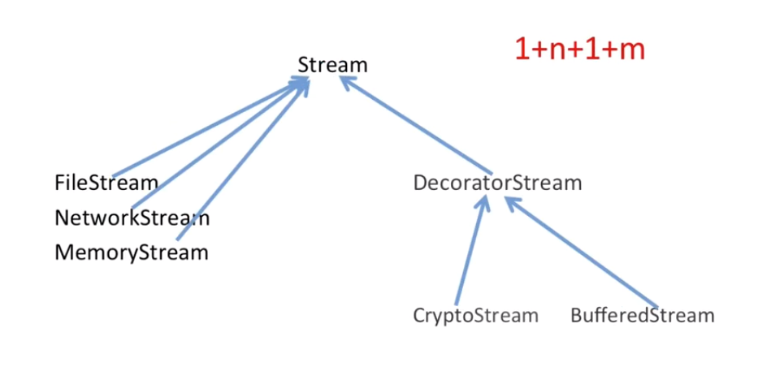
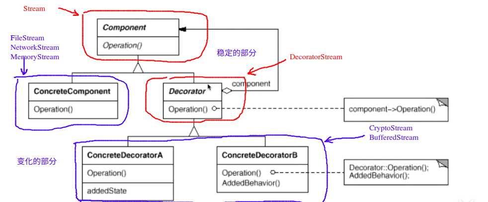

# Decorator 装饰模式

## “单一职责”模式

* 在软件组件的设计当中，如果责任的划分不清晰，使用继承得到的结果往往是随着需求的变化，子类急剧膨胀，同时充斥着重复的代码，这个时候的关键就是划清责任

## 典型模式

* Decorator
* Bridge

## 动机

* 在某一些情况下，我们可能会“过度的使用继承来扩展对象的功能”，由于继承为类型引入的静态的特质，使得这种扩展的方式缺乏灵活性；并且随着子类的增多（扩展功能的增多），各种子类的组合（**扩展功能的组合**）会导致子类的膨胀

## 模式定义

* 动态（组合） 地对一个对象增加一些额外的职责。就增加灵活性而言，Decorator 模式比生成子类（继承）更为灵活（消除重复代码& 减少子类的个数）。

## 例子

我们考虑下面的一个关于文件流的例子：

```c++
// 业务操作
class Stream{
public:
    virtual char Read(int number) = 0;
    virtual void Seek(int position) = 0;
    virtual void Write(char data) = 0;

    virtual ~Stream() {}
};
/**
 * 对于不同的流，具有不同的实现的方式
*/
//主体类
class FileStream : public Stream{
public:
    virtual char Read(int number){
        // 读文件
    }
    virtual void Seek(int position){
        //定位文件流
    }
    virtual void Write(char data){
        // 写文件
    }
};

class NetworkStream : public Stream{
public:
    virtual char Read(int number){
        // 读网络流
    }
    virtual void Seek(int position){
        //定位网络流
    }
    virtual void Write(char data){
        // 写网络流
    }
};

class MemoryStream : public Stream{
public:
    virtual char Read(int number){
        // 读内存流
    }
    virtual void Seek(int position){
        //定位内存流
    }
    virtual void Write(char data){
        // 写内存流
    }
};

/**
 * 我们对于每一种流，可能有加密的需求
 * 我们需要对文件流进行加密，对网络流进行加密，对内存流进行加密
*/
//扩展操作
class CryptoFileStream : public FileStream{
public:
    virtual char Read(int number){
        //额外的加密操作
        FileStream::Read(number);
        //额外的加密操作
    }
    virtual void Seek(int position){
        //额外的加密操作
        FileStream::Seek(position);
        //额外的加密操作
    }
    virtual void Write(char data){
        //额外的加密操作
        FileStream::Write(data);
        //额外的加密操作
    }
};

class CryptoNetworkStream : public NetworkStream{
public:
    virtual char Read(int number){
        //额外的加密操作
        NetworkStream::Read(number);
        //额外的加密操作
    }
    virtual void Seek(int position){
        //额外的加密操作
        NetworkStream::Seek(position);
        //额外的加密操作
    }
    virtual void Write(char data){
        //额外的加密操作
        NetworkStream::Write(data);
        //额外的加密操作
    }
};

class CryptoMemoryStream : public MemoryStream{
public:
    virtual char Read(int number){
        //额外的加密操作
        MemoryStream::Read(number);
        //额外的加密操作
    }
    virtual void Seek(int position){
        //额外的加密操作
        MemoryStream::Seek(position);
        //额外的加密操作
    }
    virtual void Write(char data){
        //额外的加密操作
        MemoryStream::Write(data);
        //额外的加密操作
    }
};

/**
 * 如果我们还有对于流的缓冲操作的需求的话
*/

class BufferedFileStream : public FileStream{
    // .....
};
class BufferedNetworkStream : public FileStream{
    //.....
};
class BufferedMemoryStream : public MemoryStream{
    // ....
};
/***
 * 如果我们即需要进行缓冲又需要进行加密的话
*/
class CryptoBufferedFileStream : FileStream{
public:
    virtual char Read(int number){
        //额外的加密的操作
        //额外的缓冲的操作
        FileStream::Read(number);
        //.....
    }
    virtual void Seek(int position){
        // ....
    }
    virtual void Write(char data){
        // ....
    }
};
void process(){
    // 编译时装配
    CryptoFileStream *fs1 = new CryptoFileStream();
    BufferedFileStream * fs2 = new BufferedFileStream();
    CryptoBufferedFileStream * fs3 = new CryptoBufferedFileStream();
}
```

上面的这一段代码的结构如下：



> 这种结构所需要构造的类的个数是非常的巨大的，当多个不同的需求之间需要进行结合的时候（如结合加密和缓冲），数量以阶乘上升

> 加密流的操作往往不因流的类型的不同而不同，加密的操作往往是相同的，这就造成了代码上的一种冗余

**对上面的代码进行重构**

```c++
// 业务操作
class Stream{
public:
	virtual char Read(int number) = 0;
	virtual void Seek(int position) = 0;
	virtual void Write(char data) = 0;

	virtual ~Stream() {}
};
/**
 * 对于不同的流，具有不同的实现的方式
*/
//主体类
class FileStream : public Stream{
public:
	virtual char Read(int number){
		// 读文件
	}

	virtual void Seek(int position){
		//定位文件流
	}

	virtual void Write(char data){
		// 写文件
	}
};

class NetworkStream : public Stream{
public:
	virtual char Read(int number){
		// 读网络流
	}

	virtual void Seek(int position){
		//定位网络流
	}

	virtual void Write(char data){
		// 写网络流
	}
};

class MemoryStream : public Stream{
public:
	virtual char Read(int number){
		// 读内存流
	}

	virtual void Seek(int position){
		//定位内存流
	}

	virtual void Write(char data){
		// 写内存流
	}
};

/**
 * 让代码在编译时期具有相同的结构，而变化通过运行时期的多态的动态绑定来实现
*/
//扩展操作
class CryptoStream : public Stream{

	Stream* stream; // = new ***Stream();

public:

	CryptoStream(Stream* stm) : stream(stm){}

	virtual char Read(int number){
		//额外的加密操作
		stream->Read(number);
		//额外的加密操作
	}
	virtual void Seek(int position){
		//额外的加密操作
		stream->Seek(position);
		//额外的加密操作
	}
	virtual void Write(char data){
		//额外的加密操作
		stream->Write(data);
		//额外的加密操作
	}
};

/**
 * 如果我们还有对于流的缓冲操作的需求的话
*/

class BufferedStream : public Stream{
	Stream* stream; // = new ***stream();

public:
	BufferedStream(Stream* stm) : stream(stm) {}
	// .....
	virtual char Read(int number) {// ....
	}
	virtual void Seek(int position){ // ....
	}
	virtual void Write(char data){// ....
	}
};

/**
 * 上面的这一系列的操作实际上已经完成了整个代码的重构的过程
 * 但是，我们可以看到，在 CryptoStream 和 BufferedStream 中有公用的字段 Stream* 
 * 因此我们可以考虑将这个字段提取到更高层的一个类中
*/

void process(){
	// 运行时装配
	FileStream* s1 = new FileStream();
	CryptoStream* s2 = new CryptoStream(s1);

	BufferedStream* s3 = new BufferedStream(s1);	// 文件缓存流

	BufferedStream* s4 = new BufferedStream(s2);	// 文件的加密缓存流
}
```

> 但是，我们可以看到，在 CryptoStream 和 BufferedStream 中有公用的字段 Stream因此我们可以考虑将这个字段提取到更高层的一个类中

```c++
// 业务操作
class Stream{
public:
	virtual char Read(int number) = 0;
	virtual void Seek(int position) = 0;
	virtual void Write(char data) = 0;

	virtual ~Stream() {}
};
/**
 * 对于不同的流，具有不同的实现的方式
*/
//主体类
class FileStream : public Stream{
public:
	virtual char Read(int number){
		// 读文件
	}

	virtual void Seek(int position){
		//定位文件流
	}

	virtual void Write(char data){
		// 写文件
	}
};

class NetworkStream : public Stream{
public:
	virtual char Read(int number){
		// 读网络流
	}

	virtual void Seek(int position){
		//定位网络流
	}

	virtual void Write(char data){
		// 写网络流
	}
};

class MemoryStream : public Stream{
public:
	virtual char Read(int number){
		// 读内存流
	}

	virtual void Seek(int position){
		//定位内存流
	}

	virtual void Write(char data){
		// 写内存流
	}
};

/**
 * 添加一个中间的装饰类，将CryptoStream 类和 BufferedStream 类中的
 * Stream* 变量提取到这个类当中
*/
class DecoratorStream : public Stream{
protected:
	Stream* stream;

	DecoratorStream(Stream* stm) : stream(stm){}
};

/**
 * 让代码在编译时期具有相同的结构，而变化通过运行时期的多态的动态绑定来实现
*/
//扩展操作
class CryptoStream : public DecoratorStream{
public:

	CryptoStream(Stream* stm) : DecoratorStream(stm){}	// 调用装饰类的构造函数

	virtual char Read(int number){
		//额外的加密操作
		stream->Read(number);
		//额外的加密操作
	}
	virtual void Seek(int position){
		//额外的加密操作
		stream->Seek(position);
		//额外的加密操作
	}
	virtual void Write(char data){
		//额外的加密操作
		stream->Write(data);
		//额外的加密操作
	}
};

/**
 * 如果我们还有对于流的缓冲操作的需求的话
*/

class BufferedStream : public DecoratorStream{
public:
	BufferedStream(Stream* stm) : DecoratorStream(stm) {}
	// .....
	virtual char Read(int number) {// ....
	}
	virtual void Seek(int position){ // ....
	}
	virtual void Write(char data){// ....
	}
};

/**
 * 上面的这一系列的操作实际上已经完成了整个代码的重构的过程
 * 但是，我们可以看到，在 CryptoStream 和 BufferedStream 中有公用的字段 Stream* 
 * 因此我们可以考虑将这个字段提取到更高层的一个类中
*/

void process(){
	// 运行时装配
	FileStream* s1 = new FileStream();
	CryptoStream* s2 = new CryptoStream(s1);

	BufferedStream* s3 = new BufferedStream(s1);	// 文件缓存流

	BufferedStream* s4 = new BufferedStream(s2);	// 文件的加密缓存流
}
```

重构之后的代码的结构如下所示：



## 结构



## 要点总结

1. 通过采用组合而不是继承的方式，Decorator 模式实现了在运行时动态扩展对象功能的能力，并且可以根据需要扩展多个功能。避免了使用继承带来的“灵活性差”和“多子类衍生的问题“
2. Decorator类在接口上表现为 is-a Commponent 的继承关系，即Decorator 类继承了 Commponent所具有的接口。但是实现上又表现为 has-a Commponent的组合关系，即Decorator类又使用了另一个 Commponent类
3. Decorator模式的目的并非为了解决“多子类衍生的多继承问题”，Decorator模式应用的要点在于解决“主体类在多个方向上的扩展功能”----这就是“装饰”的含义