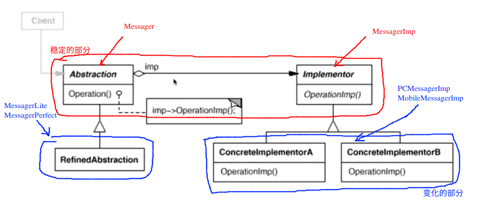

# Bridge 桥模式

## 动机

* 由于某些类型的故有的实现逻辑，使得它们具有两个变换的维度，乃至于多个维度的变化

## 模式定义

将抽象部分（**业务功能**）与实现部分（**平台实现**）分离，使它们可以独立的变化

## 例子：

我们有一个软件需要完成一些消息发送的功能，有两个变换的需求，一个是平台（PC, Mobile...)。一个是软件版本的变化需求（Lite版，Perfect版）。```bridge1.cpp```

```c++
class string {/*具体的实现省略*/};
class Image {/*具体的实现省略*/};

class Messager{
public:
	virtual void Login(string username, string password) = 0;
	virtual void SendMessage(string message) = 0;
	virtual void SendPicture(Image image) = 0;

	virtual void PlaySound() = 0;
	virtual void DrawShape() = 0;
	virtual void WriteText() = 0;
	virtual void Connect() = 0;

	virtual ~Messager() {}
};

//平台实现 n

class PCMessagerBase : public Messager{
public:
	virtual void PlaySound(){
		// ********
	}
	virtual void DrawShape(){
		// **********
	}
	virtual void WriteText(){
		// **********
	}
	virtual void Connect(){
		// **********
	}
};

class MobileMessagerBase : public Messager{
public:
	virtual void PlaySound(){
		// =========
	}
	virtual void DrawShape(){
		// =========
	}
	virtual void WriteText(){
		// =========
	}
	virtual void Connect(){
		// =========
	}
};

// 业务抽象 m

// 类的数目 1 + n + n * m

class PCMessagerLite : public PCMessagerBase{
public:
	virtual void Login(string username, string password){
		PCMessagerBase::Connect();
		// ...........
	}
	virtual void SendMessage(string message){
		PCMessagerBase::WriteText();
		// ...............
	}
	virtual void SendPicture(Image image){
		PCMessagerBase::DrawShape();
		// ............
	}
};

class PCMessagerPerfect : public PCMessagerBase{
public:
	virtual void Login(string username, string password){
		PCMessagerBase::PlaySound();
		// ***********
		PCMessagerBase::Connect();
		// ...........
	}
	virtual void SendMessage(string message){
		PCMessagerBase::PlaySound();
		// *********
		PCMessagerBase::WriteText();
		// ...............
	}
	virtual void SendPicture(Image image){
		PCMessagerBase::PlaySound();
		// ***********
		PCMessagerBase::DrawShape();
		// ............
	}
};

class MobileMessagerLite : public MobileMessagerBase{
public:
	virtual void Login(string username, string password){
		MobileMessagerBase::Connect();
		// ...........
	}
	virtual void SendMessage(string message){
		MobileMessagerBase::WriteText();
		// ...............
	}
	virtual void SendPicture(Image image){
		MobileMessagerBase::DrawShape();
		// ............
	}
};

class MobileMessagerPerfect : public MobileMessagerBase{
public:
	virtual void Login(string username, string password){
		MobileMessagerBase::PlaySound();
		// *******
		MobileMessagerBase::Connect();
		// ...........
	}
	virtual void SendMessage(string message){
		MobileMessagerBase::PlaySound();
		// *******
		MobileMessagerBase::WriteText();
		// ...............
	}
	virtual void SendPicture(Image image){
		MobileMessagerBase::PlaySound();
		// *******
		MobileMessagerBase::DrawShape();
		// ............
	}
};
```

上面的代码在需求增多的时候，需要书写大量的子类完成相应的工作，我们考虑下面的重构：```bridge2.cpp```

```c++

class string {/*具体的实现省略*/};
class Image {/*具体的实现省略*/};

/**
 * 将 bridge1 中的 Messager 拆分为两个抽象基类
 * 将两部分的实现分割开
*/
class Messager{
protected:
	MessagerImp* messagerImp;
public:
	Messager(MessagerImp* imp) : messagerImp(imp) {}
	/**
	 * 这里的几个方法是抽象层面的方法，其不考虑平台的差异性
	*/
	virtual void Login(string username, string password) = 0;
	virtual void SendMessage(string message) = 0;
	virtual void SendPicture(Image image) = 0;

	virtual ~Messager() {}
};

class MessagerImp{
public:
	/**
	 * 这几个函数在不同的平台下具有不同的实现方法
	*/
	virtual void PlaySound() = 0;
	virtual void DrawShape() = 0;
	virtual void WriteText() = 0;
	virtual void Connect() = 0;

	virtual ~MessagerImp() {}
};

//平台实现 n
/**
 * 平台的实现是一个需求变化的方向
 * 除了 PC 端，mobile 端，可能以后还会增加 Linux 端， Mac 端等等
*/
class PCMessagerImp : public MessagerImp{
public:
	virtual void PlaySound(){
		// ********
	}
	virtual void DrawShape(){
		// **********
	}
	virtual void WriteText(){
		// **********
	}
	virtual void Connect(){
		// **********
	}
};

class MobileMessagerImp : public MessagerImp{
public:
	virtual void PlaySound(){
		// =========
	}
	virtual void DrawShape(){
		// =========
	}
	virtual void WriteText(){
		// =========
	}
	virtual void Connect(){
		// =========
	}
};

// 业务抽象 m
/**
 * 业务层面上，我们的软件设计有一个简洁版本 lite,和一个华丽版本 Perfect
 * 比如 ： 轻聊版 / 完整版
 * 实际当中可能有更加复杂的分类方式
*/
/**
 * 业务的抽象也是一个需求变化的方向
 * 除了 Lite 版和 Perfect 版， 以后可能会增加 企业版，学校版，监狱版等等
*/
/**
 * 上面的两种需求结合起来就会有构成大量的需求类别：例如 企业Lite版，监狱Perfect版
*/
// 类的数目 1 + n + m

class MessagerLite : public Messager{
public:

	MessagerLite(MessagerImp* imp) : Messager(imp){}

	virtual void Login(string username, string password){
		messagerImp->Connect();
		// ...........
	}
	virtual void SendMessage(string message){
		messagerImp->WriteText();
		// ...............
	}
	virtual void SendPicture(Image image){
		messagerImp->DrawShape();
		// ............
	}
};

class MessagerPerfect : public Messager{
public:

	MessagerPerfect(MessagerImp* imp) : Messager(imp) {}

	virtual void Login(string username, string password){
		messagerImp->PlaySound();
		// ***********
		messagerImp->Connect();
		// ...........
	}
	virtual void SendMessage(string message){
		messagerImp->PlaySound();
		// *********
		messagerImp->WriteText();
		// ...............
	}
	virtual void SendPicture(Image image){
		messagerImp->PlaySound();
		// ***********
		messagerImp->DrawShape();
		// ............
	}
};


void process(){
	// 运行时装配
	MessagerImp* pcImp = new PCMessagerImp();
	MessagerImp* mImp = new MobileMessagerImp();

	Messager* m1 = new MessagerLite(pcImp);	// lite 版本 PC 端
	Messager* m2 = new MessagerLite(mImp);	// lite 版本 mobile 端

	Messager* m3 = new MessagerPerfect(pcImp); // perfect 版本 PC 端
} 
```

上面重构后的代码，在需求增加的时候，也不需要书写大量的子类代码

## 结构



 ## 要点总结

1. Bridge 模式使用“对象间的组合关系” 解耦了抽象和实现之间固有的绑定关系，使得抽象和实现可以沿着各自的维度来变化。所谓的抽象和实现沿着各自的维度变化，就是 “子类化”它们
2. Bridge 模式有时候类似于多继承的方案，但是多继承的方案违背了单一职责的原则（即一个类只有一个变化的原因），复用性比较的差
3. Bridge 模式一般应用在“两个非常强的变化维度”，一般一个类也有多于两个的变化维度，这时可以使用 Bridge 的扩展模式