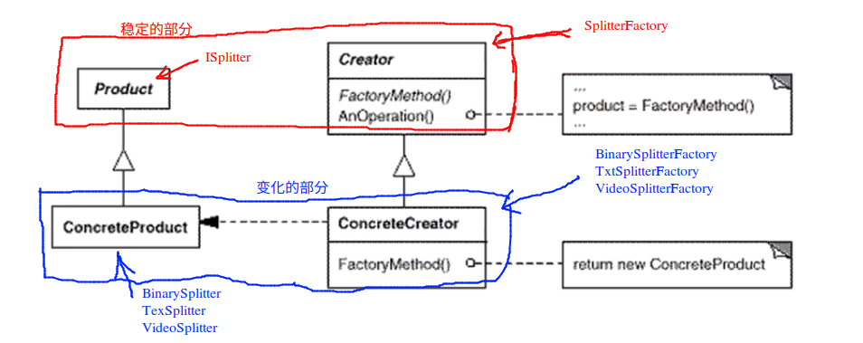

# Factory Method 工厂方法

## “对象创建”模式

* 通过“对象创建”模式绕开 new，来避免 new（对象创建）过程中导致的紧耦合（依赖具体类），从而支持对象创建的稳定。它是接口抽象之后的第一步工作。
* 典型模式
  * Factory Method
  * Abstract Factory
  * Prototype
  * Builder
* 上面的四种模式当中，前面两种模式使用比较的频繁，后面两种模式使用的比较的少

## 动机

* 在软件系统当中，经常面临着创建对象的工作；由于需求的变化，需要创建的对象的具体的类型经常变化

 ## 模式定义

定义一个用于创建对象的接口，让子类决定实例化哪一个类。Factory Method 使得一个类的实例化延迟（目的：解耦和，手段：虚函数）到子类

## 例子

考虑下面的文件分割的例子: ```Splitter2.cpp```

```c++
class ISplitter{
public:
	virtual void split() = 0;
	virtual ~ISplitter() {}
};

class BinarySplitter : public ISplitter{
public:
	// 构造方法
	virtual void split(){
		//.....
	}
};

class TxtSplitter : public ISplitter{
public:
	virtual void split(){
		// ******
	}
};

class PictureSplitter : public ISplitter{
public:
	virtual void split(){
		// ....
	}
};

class VideoSplitter : public ISplitter{
public:
	virtual void split(){
		// .......
	}
};
```

```MainForm2.cpp```：

```c++
class Form{/*已经实现*/};
class TextBox{/*已经实现*/};
class ProgressBar{/*已经实现*/};

#include "./Splitter2.cpp"

class MainForm : public Form{
	TextBox*		textFilePath;
	TextBox*		textFileNumber;
	ProgressBar*	progressBar;

public:
	void Button1_Click(){
		string filePath = textFilePath->getText();
		int number = atoi(textFileNumber->getText().c_str());

		ISplitter* splitter = new BinarySplitter(filePath, number);	// 面向接口
		/**
		 * 虽然这里使用了抽象的接口类型 ISplitter,但是后面的 new 的过程依然是一个具体的类
		 * BinarySplitter，那么依然存在类之间的依赖关系。这种关系是在程序的编译期间就会确定下来
		*/
		/**
		 * 那么我们的设计目标就是要绕开这个 new 带来的依赖的问题
		 * 在面对接口的设计中，我们不能等式的左边变成了依赖抽象，但是等式的右边还是依赖具体类。我们等式
		 * 右边也应该依赖于抽象
		*/
		splitter->split();
	}
};
```

针对上面的问题，采用了下面的重构过程：```FactorySplitter.cpp```

```c++
//抽象
class ISplitter{
public:
	virtual void split() = 0;
	virtual ~ISplitter() {}
};

//抽象
class SplitterFactory{
public:
	virtual ISplitter* CreateSplitter() = 0;
	virtual ~SplitterFactory() {}
};

// 具体类
class BinarySplitter : public ISplitter{
public:
	virtual void split(){
		//.....
	}
};

class TxtSplitter : public ISplitter{
public:
	virtual void split(){
		// ******
	}
};

class PictureSplitter : public ISplitter{
public:
	virtual void split(){
		// ....
	}
};

class VideoSplitter : public ISplitter{
public:
	virtual void split(){
		// .......
	}
};

/**
 * 每一个具体的类，都有一个自己具体的工厂类
*/
// 具体工厂
class BinarySplitterFactory : public SplitterFactory{
public:
	virtual ISplitter* CreateSplitter(){
		return new BinarySplitter();
	}
};

class TxtSplitterFactory : public SplitterFactory{
public:
	virtual ISplitter* CreateSplitter(){
		return new TxtSplitter();
	}
};
 
class PictureSplitterFactory : public SplitterFactory{
public:
	virtual ISplitter* CreateSplitter(){
		return new PictureSplitter();
	}
};

class VideoSplitterFactory : public SplitterFactory{
public:
	virtual ISplitter* CreateSplitter(){
		return new VideoSplitter();
	}
};
```

```MainForm3.cpp``` :

```c++
class Form{/*已经实现*/};
class TextBox{/*已经实现*/};
class ProgressBar{/*已经实现*/};

#include "./FactorySplitter.cpp"

class MainForm : public Form{
	TextBox*		textFilePath;
	TextBox*		textFileNumber;
	ProgressBar*	progressBar;

	SplitterFactory* factory;	// 工厂
public:

	MainForm(SplitterFactory* factory){
		this->factory = factory;
	}

	void Button1_Click(){
		string filePath = textFilePath->getText();
		int number = atoi(textFileNumber->getText().c_str());
		
		
		ISplitter* splitter = factory->CreateSplitter();	// 面向接口 多态的 new
		splitter->split();
	}
};
```

## 结构




## 要点总结

1. Factory Method 用于隔离类对象的使用者和具体类型之间的耦合关系。面对一个经常变化的具体类型，紧耦合（new）会导致软件的脆弱
2. Factory Method模式通过面向对象的手法，将所需要创建的具体对象工作延迟到子类，从而实现一种扩展（而非更改）的策略，较好的解决了这种紧耦合的关系
3. Factory Method模式解决“单个对象”的需求变化。缺点在于要求创建方法/参数相同