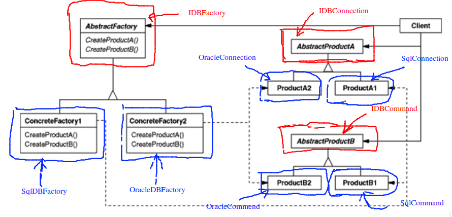

## Abstract Factory 抽象工厂

## 动机

* 在软件系统当中，经常面临着“<font color=red>一系列的相互依赖的对象</font>”的创建工作。同时，由于需求的变化，往往存在更多系列对象的创建工作

## 模式定义

* 提供一个接口，让该接口负责创建一系列“相关或者是相互依赖”的对象，无需指定它们具体的类

## 例子

我们考虑下面的问题：

```c++
#include <vector>
using namespace std;

class EmployeeDO{/*已经定义*/};

class EmployeeEAO{
public:
    vector<EmployeeDO> getEmployees(){
        /**
         * 我们现在可能使用 SQL Server
         * 但是以后的需求可能会要求使用 DB2，MYSQL，等等其他的数据库。
         * 那么应该如何满足这些需求
        */
        SqlConnecton* connection = 
            new SqlConnecton();
        connection->ConnectionString = "...";
        
        SqlCommand* command = 
            new SqlCommand();
        command->CommandText = "....";

        command->SetConnection(connection); // 命令和连接是相关的

        SqlDataReader* reader = command->ExecuteReader();
        while(reader->Read())
        {
            // ....
        }
    }
};
```

如果我们除了 SQL Server 以外，还需要支持其他的数据库，如 MYSQL 数据库，如果采用工厂方法，可以以下面的方式实现 ```EmployeeEAO2.cpp``` :

```c++
#include <vector>
using namespace std;

class EmployeeDO{/*已经定义*/};
class SqlConnecton{/*已经定义*/};

/**
 * 一系列的抽象的接口
 * 数据库访问的基类
*/
class IDBConnection{

};

// 关于这个抽象基类的一个工厂
class IDBConnectionFactory{
public:
	virtual IDBConnection* CreateDBConnection() = 0;
};

class IDBCommand{

};

class IDBCommandFactory{
public:
	virtual IDBCommand* CreateDBCommned() = 0;
};

class IDataReader{

};

class IDataReaderFactory{
public:
	virtual IDataReader* CreateDataReader() = 0;
};

// 支持SQL Server
class SqlConnection : public IDBConnection{

};

// 具体类的工厂
class SqlConnectionFactory : public IDBCommandFactory{
// 实现抽象方法
};

class SqlCommand : public IDBCommand{

};

// 具体类的工厂
class SqlCommandFactory : public IDBCommandFactory{
// 实现抽象方法
};

class SqlDataReader : public IDataReader{

};

class SqlDataReader : public IDataReaderFactory{
// 实现抽象方法
};


// 也要支持 Oracle
/**
 * Oracle 同样也要实现这些方法
*/
class OracleConnection : public IDBConnection{

};

class OracleCommand : public IDBCommand{

};

class OracleDataReader : public IDataReader{

};

// 甚至更多的数据库类型

class EmployeeEAO{
	/**
	 * 依赖并没有消失，而是被放到了更加上层的代码当中，用传参的方式传入到这里
	 * 当前的类本身不依赖任何的具体类，只依赖于抽象
	 * 具体类型的绑定被延时到运行期间，通过虚函数来实现
	*/
	IDBConnectionFactory*		dbConnectionFactory;
	IDBCommandFactory*			dbCommandFactory;
	IDataReaderFactory*			dataReaderFactory;		
	/**
	 * 这里有非常明显的依赖关系，例如，Oracle 的连接器，一定要搭配 Oracle 的命令。
	 * 所以上面的三个工厂，一个确定下来那么其他的两个也就确定下来，你不可能 ConnectionFactory 
	 * 传入 Oracle 的，CommandFactory 传入 MySQL 的，那代码的执行过程一定会出错
	*/
public:
	vector<EmployeeDO> getEmployees(){
		/**
		 * 我们现在可能使用 SQL Server
		 * 但是以后的需求可能会要求使用 DB2，MYSQL，等等其他的数据库。
		 * 那么应该如何满足这些需求
		*/
		IDBConnection* connection = 
			dbCommandFactory->CreateDBCommned();
		connection->ConnectionString("...");
		
		IDBCommand* command = 
			dbCommandFactory->CreateDBCommned();
		command->CommandText("....");

		command->SetConnection(connection);	// 命令和连接相关联  // 关联性

		IDataReader* reader = dataReaderFactory->CreateDataReader();	// 关联性
		while(reader->Read())
		{
			// ....
		}
	}
};
```

上面的代码如何进行改进，```EmployeeEAO3.cpp``` :

```c++
#include <vector>
using namespace std;

class EmployeeDO{/*已经定义*/};
class SqlConnecton{/*已经定义*/};

/**
 * 一系列的抽象的接口
 * 数据库访问的基类
*/
class IDBConnection{
//一些抽象方法
};

class IDBCommand{
// 一些抽象方法
};

class IDataReader{
// 一些抽象方法
};

/**
 * 三个工厂合并为一个
*/
class IDBFactory{
public:
	virtual IDBConnection*	CreateDBConnection() = 0;
	virtual IDBCommand*		CreateDBCommand() = 0;
	virtual IDataReader*	CreateDataReader() = 0;	
};


// 支持SQL Server
class SqlConnection : public IDBConnection{

};

class SqlCommand : public IDBCommand{

};

class SqlDataReader : public IDataReader{

};

// SQL Server 的工厂
class SqlDBFactory : public IDBFactory{
// 实现三个抽象方法
};

// 也要支持 Oracle
/**
 * Oracle 同样也要实现这些方法
*/
class OracleConnection : public IDBConnection{

};

class OracleCommand : public IDBCommand{

};

class OracleDataReader : public IDataReader{

};

// 甚至更多的数据库类型

class EmployeeEAO{
	IDBFactory* 	dbFactory;	// 只需要一个工厂

public:
	vector<EmployeeDO> getEmployees(){
		/**
		 * 我们现在可能使用 SQL Server
		 * 但是以后的需求可能会要求使用 DB2，MYSQL，等等其他的数据库。
		 * 那么应该如何满足这些需求
		*/
		IDBConnection* connection = 
			dbFactory->CreateDBCommned();
		connection->ConnectionString("...");
		
		IDBCommand* command = 
			dbFactory->CreateDBCommned();
		command->CommandText("....");

		command->SetConnection(connection);	// 命令和连接相关联  // 关联性

		IDataReader* reader = dbFactory->CreateDataReader();	// 关联性
		while(reader->Read())
		{
			// ....
		}
	}
};
```

## 结构

重构之后的代码的结构如图所示：



## 要点总结

1. 如果没有应对“多系列对象构建”的需求变化，则没有必要使用 _Abstract Factory_，只要使用简单的工厂模式就可以了
2. “系列对象”指的是在某一特定系列下的对象之间有相互依赖或作用关系。不同系列之间的对象不能相互依赖
3. _Abstract Factory_ 主要应对“**新系列**“的需求变动。其缺点在于难以应对“**新对象**“的需求变动
   * 新系列：比如添加 DB2 数据库的支持，或者 MYSQL 数据库的支持
   * 新对象：比如除了 Connect, Commend, Reader 以外我们要添加一个 Writer

